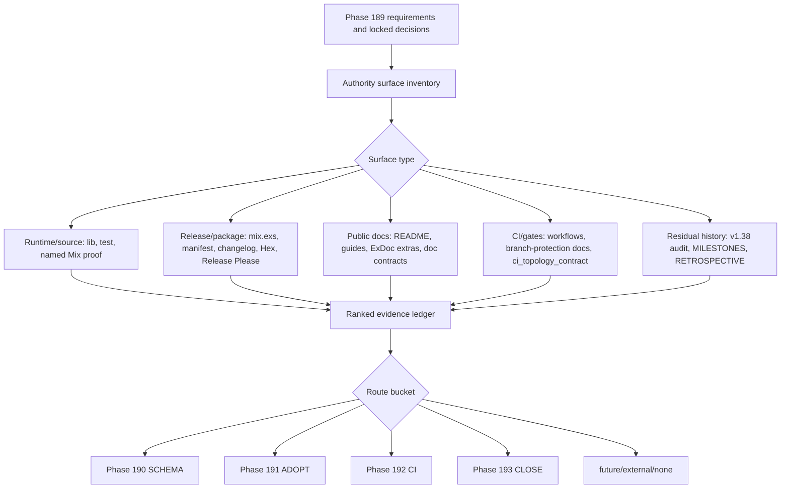

# Phase 189: Quality Baseline and Authority-Surface Audit - Research

**Researched:** 2026-07-01
**Domain:** Audit-only quality baseline for an Elixir/Phoenix/Plug/Ecto/PostgreSQL OSS library/app
**Confidence:** HIGH for repo-local planning guidance; MEDIUM for external ASVS taxonomy

<user_constraints>
## User Constraints (from CONTEXT.md)

### Locked Decisions
## Implementation Decisions

### Audit Scoring Shape

- **D-189-01:** Phase 189 should produce one ranked Markdown audit artifact with YAML frontmatter and a weakest-first evidence ledger. The artifact should be built for downstream action, not as a generic consulting memo.
- **D-189-02:** Use score `0-4`, with confidence kept separate:
  - `0` = unknown, unproven, or broken trust boundary
  - `1` = must-fix adoption, operations, release, or maintainer risk
  - `2` = workable with material residual
  - `3` = good enough for current claims
  - `4` = strong/proven
- **D-189-03:** Every scored row must include: quality dimension, evidence refs, confidence (`High` / `Medium` / `Low`), practical consequence, highest-leverage fix, priority, route bucket, and owner phase (`190`, `191`, `192`, `193`, `future`, `external`, or `none`).
- **D-189-04:** Include a visible good-enough/N/A appendix. Do not manufacture fake concerns to make every checklist item look equally important.
- **D-189-05:** Include a QUAL-03 residual table covering at minimum SEED-005/reconnect, screenshot-regression confidence, external pilot boundaries, host staging ownership, known CI/example-app residuals, Hex/dependency notes, and legacy Nyquist/planning residuals.

### Authority Surface Hierarchy

- **D-189-06:** Use an evidence-first, scope-aware hierarchy. Planning defines what must be audited, but current-tree proof decides what is true.
- **D-189-07:** For runtime/source behavior claims, executable proof wins: source code, focused tests, named `mix verify.*` / `mix ci.*` bundles, current CI job behavior, and clean-tree verification evidence outrank prose and stale planning metadata.
- **D-189-08:** For release/version/package claims, `mix.exs`, `.release-please-manifest.json`, CHANGELOG/release metadata, Hex package truth, Release Please wiring, and doc-contract-guarded public docs must be reconciled. If these disagree, classify it as Phase 191 drift rather than choosing the convenient file.
- **D-189-09:** For public adopter guidance, README/guides/HexDocs are the surface users see, but they do not override current-tree proof when known stale. They define what must be repaired or honestly narrowed.
- **D-189-10:** For gate readiness, GitHub Actions required checks, stable CI job ids, `mix ci.all`, and branch-protection docs decide merge/release posture only after residual ownership is explicit.
- **D-189-11:** For scope and priority, `.planning/ROADMAP.md`, `.planning/REQUIREMENTS.md`, `.planning/STATE.md`, milestone audits, and retrospectives decide intent, invariants, residual history, and owner phase. They are not shipped truth by themselves.
- **D-189-12:** Prefer named rerun bundles and `VERIFICATION.md`/`VALIDATION.md` evidence over audit prose when closing requirements. This carries forward the v1.22/v1.38 lesson that proof-chain completeness beats authored verdicts.

### Residual And Seed Triage Thresholds

- **D-189-13:** Use this trust-boundary taxonomy: `Blocker`, `Must fix before publish`, `Prove before claim`, `External-owned`, `Maintenance note`, `Backlog cleanup`, `Future seed`, `Good enough`, and `N/A`.
- **D-189-14:** `Blocker` is reserved for current false public claims, required release/branch-protection gates that are red from current code, broken storage/capture/query/auth correctness, security-sensitive footguns, or proof gaps that make an active requirement impossible to close honestly.
- **D-189-15:** `Must fix before publish` applies when a defect may not block Phase 189 planning but would make a new Hex release, README promise, upgrade story, or v1.39 closeout misleading.
- **D-189-16:** `Prove before claim` applies to screenshot stability, broad visual regression, real assistive-technology certification, external staging/pilot claims, and any other area where existing proof is narrower than the tempting claim.
- **D-189-17:** `External-owned` applies to host staging and real adopter pilot evidence unless there is named integrator-controlled evidence. Threadline may provide templates/rubrics, not pretend to operate third-party staging.
- **D-189-18:** `Maintenance note` applies to Hex auth-session warnings, dependency advisory output, and tool-environment notes unless they affect shipped code, package installability, or a required release gate.
- **D-189-19:** `Backlog cleanup` applies to legacy planning/Nyquist/frontmatter residuals unless active v1.39 traceability depends on them.
- **D-189-20:** SEED-005/reconnect should not be treated as unimplemented by default. It becomes must-fix only if current real socket-drop proof fails, disconnected/mutating affordances are unsafe, or the quality audit proves the current banner behavior is a trust-impacting operator failure mode.
- **D-189-21:** Screenshot regression confidence should remain `Prove before claim` unless the intended local runner/bootstrap passes. Do not make a broad screenshot stability claim from a local-only or failed-bootstrap command.
- **D-189-22:** Broad CI/example-app residuals block only when they are required release gates or current-code regressions. If targeted phase proof is green and the residual is inherited/out of scope, keep it visible without relabeling it green.

### v1.39 Narrowing Rule

- **D-189-23:** Use the authority-surface gate as the Phase 189 narrowing rule: a finding may constrain phases 190-193 only if it is backed by repo evidence and affects a current adoption, production, support, release, or maintainer authority surface already promised by v1.39.
- **D-189-24:** Route findings as:
  - `Must-fix now` if a current public claim, release gate, storage-schema contract, CI trust claim, or security/correctness invariant is false and cannot be honestly narrowed.
  - `Phase-owned` if it maps cleanly to SCHEMA in Phase 190, ADOPT in Phase 191, CI in Phase 192, or CLOSE in Phase 193.
  - `Future seed` if it is real but scope-expanding, such as external pilot depth, richer observability, UI regression hardening, or reconnect UX beyond current proof.
  - `N/A` / `Good enough` if the dimension is out of category, already proven for current claims, or intentionally unclaimed.
- **D-189-25:** Do not let Phase 189 broaden v1.39 into another UI/product/compliance milestone. Its job is to focus the remaining work, not maximize the number of findings.
- **D-189-26:** Phase 193 should use the Phase 189 ledger as its closeout input: verify what was fixed, preserve what was deferred, and recommend CI/CD depth, external adopter proof, observability, or hold.

### Ecosystem And Product Lessons To Apply

- **D-189-27:** Treat verification as a product surface. Named `mix verify.*` / `mix ci.*` entrypoints, doc contracts, release checks, and example-app proof are part of Threadline's adopter UX.
- **D-189-28:** Preserve Threadline's core audit-domain separation: capture, semantics, and exploration/operations are distinct. Do not collapse database activity auditing, audit history, operator evidence, and compliance guarantees into one vague quality bucket.
- **D-189-29:** Favor boring, explicit Elixir/Phoenix library idioms: optional dependencies stay optional, public claims are doc-contract guarded, current source/test proof beats stale prose, and host-owned seams stay host-owned.
- **D-189-30:** Learn from audit libraries across ecosystems: copy explicit actor/context metadata, queryable storage, migration/upgrade honesty, disable/maintenance paths, and human-readable history; avoid callback-only missed writes, opaque YAML/binary blobs, fragile process/thread/connection-local context, record-local history that disappears on delete, and association magic that grows beyond its support contract.
- **D-189-31:** Use Threadline brand/microcopy guidance for the audit artifact: say what failed, why it matters, and the next action in plain language. Avoid vague terms like "enterprise-grade", "robust", "next-generation", or generic severity theater.

### the agent's Discretion

Downstream agents may choose the exact audit artifact filename, row ordering, grouping names, and whether to include a short executive summary before the ledger. They should preserve the locked scoring rubric, authority hierarchy, triage taxonomy, routing rule, and no-scope-creep boundary above.

### Deferred Ideas (OUT OF SCOPE)

- External pilot proof remains signal-gated and external-owned unless a named adopter/integrator provides evidence.
- Host staging depth remains integrator-owned; Threadline owns templates/rubrics and modest in-repo pointers only.
- Broad screenshot-stability promotion remains deferred unless Phase 189/193 classifies UI regression confidence as a top trust risk and a future UI-REG phase is explicitly selected.
- Reconnect/offline UX beyond current proof remains a future seed unless the audit finds current operator behavior trust-breaking.
- Richer production observability remains a future seed unless the quality ranking makes production debuggability a top v1.40 recommendation.
- Runtime destructive redaction, compliance packs, legal hold, immutable archive guarantees, WAL/CDC backend, public Storybook, and public component API remain out of scope.
- No todo artifacts matched Phase 189, so none were folded or reviewed.
</user_constraints>

<phase_requirements>
## Phase Requirements

| ID | Description | Research Support |
|----|-------------|------------------|
| QUAL-01 | Maintainers can read a repo-evidence software-quality audit that identifies the weakest quality dimensions, scores confidence, explains practical consequences, and ranks the highest-leverage fixes. | Use a single ranked evidence ledger with score `0-4`, separate confidence, evidence refs, consequence, highest-leverage fix, priority, route bucket, and owner phase. [CITED: .planning/phases/189-quality-baseline-and-authority-surface-audit/189-CONTEXT.md] |
| QUAL-02 | The audit separates must-fix adoption/operations/maintainer risks from good-enough, low-priority, or N/A dimensions; it does not flatten every checklist item into generic consulting advice. | Use the locked trust-boundary taxonomy and include a visible good-enough/N/A appendix so weak rows do not erase proven or intentionally unclaimed surfaces. [CITED: .planning/phases/189-quality-baseline-and-authority-surface-audit/189-CONTEXT.md] |
| QUAL-03 | Open residuals and seeds that affect quality trust are triaged, including SEED-005 reconnect/offline banner, screenshot-regression confidence, external pilot boundaries, host staging ownership, and known CI/example-app residuals. | Require a residual table covering SEED-005/reconnect, screenshots, external pilot, host STG, CI/example-app, Hex/dependency, and legacy Nyquist/planning residuals. [CITED: .planning/phases/189-quality-baseline-and-authority-surface-audit/189-CONTEXT.md] |
</phase_requirements>

## Summary

Phase 189 should be planned as a docs/planning audit phase that produces a durable Markdown artifact, not as an implementation phase for schema, docs, CI, or UI fixes. [VERIFIED: codebase grep] The output should be a weakest-first evidence ledger plus a residual table, because `.planning/ROADMAP.md`, `.planning/REQUIREMENTS.md`, and `189-CONTEXT.md` all make Phase 189 responsible for ranking, classification, and routing rather than repair. [CITED: .planning/ROADMAP.md; .planning/REQUIREMENTS.md; .planning/phases/189-quality-baseline-and-authority-surface-audit/189-CONTEXT.md]

The planner should direct execution toward inspecting current authority surfaces in a fixed order: current source/tests and named `mix verify.*` proof first, release/package truth second, public docs and doc contracts third, CI job topology fourth, and planning artifacts only for scope/history. [CITED: .planning/phases/189-quality-baseline-and-authority-surface-audit/189-CONTEXT.md] This protects v1.39 from both underreacting to real public drift and overreacting to local-only, external-owned, or inherited residuals. [CITED: .planning/milestones/v1.38-MILESTONE-AUDIT.md]

**Primary recommendation:** Plan one audit artifact named `189-QUALITY-AUDIT.md` in the Phase 189 directory, with YAML frontmatter, a ranked ledger, a QUAL-03 residual table, a good-enough/N/A appendix, and a final "v1.39 narrowing" section that only routes repo-backed authority-surface findings into phases 190-193. [CITED: .planning/phases/189-quality-baseline-and-authority-surface-audit/189-CONTEXT.md]

## Project Constraints (from AGENTS.md)

No `AGENTS.md` file exists at the repository root. [VERIFIED: shell]

No project-local `.codex/skills` or `.agents/skills` instructions were found. [VERIFIED: shell]

## Architectural Responsibility Map

| Capability | Primary Tier | Secondary Tier | Rationale |
|------------|--------------|----------------|-----------|
| Quality audit artifact | Planning / repository docs | CI / test evidence | The deliverable is a planning artifact, while evidence comes from source, tests, CI, release files, and docs. [CITED: .planning/ROADMAP.md] |
| Authority-surface precedence | Repository proof | Public docs | Current executable proof decides behavior, and public docs define adopter-facing drift when they disagree. [CITED: .planning/phases/189-quality-baseline-and-authority-surface-audit/189-CONTEXT.md] |
| Storage-schema findings | Database / Ecto layer | Planning route to Phase 190 | Public docs claim configurable `storage_schema`, and current storage-schema code/tests identify this as Phase 190 evidence territory. [VERIFIED: codebase grep] |
| Release/version findings | Release automation / package metadata | Public docs | `mix.exs`, `.release-please-manifest.json`, Release Please config, CHANGELOG, Hex query output, and doc contracts must be reconciled. [VERIFIED: codebase grep; VERIFIED: mix hex.info] |
| CI/CD findings | CI / workflow layer | Local Mix aliases | `.github/workflows/ci.yml`, `.github/workflows/release.yml`, `mix ci.all`, `verify.release`, and CONTRIBUTING branch-protection docs define gate posture. [VERIFIED: codebase grep] |
| Residual and seed routing | Planning / roadmap | Source/test proof | v1.38 audit residuals and Phase 189 decisions define residual buckets, while source/tests decide whether a residual is still live. [CITED: .planning/milestones/v1.38-MILESTONE-AUDIT.md] |

## Standard Stack

No new runtime, build, or test packages should be installed for Phase 189. [CITED: .planning/phases/189-quality-baseline-and-authority-surface-audit/189-CONTEXT.md]

### Core

| Library / Tool | Version | Purpose | Why Standard |
|----------------|---------|---------|--------------|
| Elixir / Mix | 1.19.5 locally; project declares `~> 1.15`; CI uses 1.17.3 | Run Mix aliases and tests | Phase 189 validates existing proof surfaces through Mix commands and static repo inspection. [VERIFIED: shell; VERIFIED: codebase grep] |
| Erlang/OTP | OTP 28 locally; CI uses 27.0 | BEAM runtime | Local environment can run Mix; CI pinned runtime is visible in workflow setup. [VERIFIED: shell; VERIFIED: codebase grep] |
| Ecto / Ecto SQL | `ecto` 3.13.5, `ecto_sql` 3.13.5 locked | Persistence and migrations | Storage-schema findings route to Phase 190 and must respect Ecto prefix/migration behavior. [VERIFIED: mix deps] |
| Postgrex | 0.22.0 locked | PostgreSQL driver | Threadline proof depends on real PostgreSQL trigger tests and PgBouncer topology tests. [VERIFIED: mix deps; VERIFIED: codebase grep] |
| Plug | 1.19.1 locked | Plug integration surface | Threadline exposes Plug-based capture/auth integration surfaces. [VERIFIED: mix deps; VERIFIED: codebase grep] |
| Phoenix / LiveView | Phoenix 1.8.7, LiveView 1.1.30 locked; root deps optional | Optional operator UI proof | The root package keeps Phoenix/LiveView optional, while the example app and E2E tests prove the operator surface. [VERIFIED: mix deps; VERIFIED: codebase grep] |

### Supporting

| Library / Tool | Version | Purpose | When to Use |
|----------------|---------|---------|-------------|
| Credo | 1.7.18 locked | Static analysis | Cite existing `mix verify.credo`; do not add a new lint tool. [VERIFIED: mix deps; VERIFIED: codebase grep] |
| ExDoc | 0.40.1 locked | Docs build/package proof | Use existing `mix docs` and `mix verify.release` release proof. [VERIFIED: mix deps; VERIFIED: codebase grep] |
| LazyHTML | 0.1.11 locked | Test DOM parsing | Existing LiveView/component tests already depend on it; Phase 189 should not add new test parsing dependencies. [VERIFIED: mix deps] |
| Playwright | `@playwright/test` package range `^1.52.0`; lockfile package version 1.60.0 | Example-app browser proof | Use existing `mix verify.example_browser` and local-only screenshot guard boundaries. [VERIFIED: codebase grep] |
| Hex CLI | available through Mix | Package truth / release checks | `mix hex.info threadline` reports latest `0.9.0` and is the local verification command named by docs. [VERIFIED: mix hex.info; VERIFIED: codebase grep] |

### Alternatives Considered

| Instead of | Could Use | Tradeoff |
|------------|-----------|----------|
| Ranked evidence ledger | Generic OpenSSF-style scorecard | The discussion log rejected a generic scorecard because it is too security-skewed for Threadline's schema/docs/DX trust problem. [CITED: .planning/phases/189-quality-baseline-and-authority-surface-audit/189-DISCUSSION-LOG.md] |
| Existing Mix aliases and doc contracts | New one-off audit scripts | New scripts would widen the phase and duplicate established repo proof entrypoints. [VERIFIED: codebase grep] |
| Local repo authority surfaces | Synthetic external pilot | External pilot proof remains signal-gated and external-owned. [CITED: .planning/phases/189-quality-baseline-and-authority-surface-audit/189-CONTEXT.md] |

**Installation:** No installation command is recommended. [CITED: .planning/phases/189-quality-baseline-and-authority-surface-audit/189-CONTEXT.md]

## Package Legitimacy Audit

Phase 189 should install no external packages. [CITED: .planning/phases/189-quality-baseline-and-authority-surface-audit/189-CONTEXT.md]

| Package | Registry | Age | Downloads | Source Repo | Verdict | Disposition |
|---------|----------|-----|-----------|-------------|---------|-------------|
| None | n/a | n/a | n/a | n/a | n/a | No package install required. [VERIFIED: codebase grep] |

**Packages removed due to [SLOP] verdict:** none. [VERIFIED: codebase grep]
**Packages flagged as suspicious [SUS]:** none. [VERIFIED: codebase grep]

## Authority Surface Evidence Map

| Surface | Files / Commands | Precedence | Expected Conflicts | Planner Guidance |
|---------|------------------|------------|--------------------|------------------|
| Phase scope and invariants | `.planning/ROADMAP.md`, `.planning/REQUIREMENTS.md`, `.planning/STATE.md`, `189-CONTEXT.md` | Defines what Phase 189 may audit and what later phases own. [CITED: .planning/ROADMAP.md] | Planning may list future ideas that are not current shipped truth. [CITED: .planning/STATE.md] | Use for boundaries, owner phase, and no-scope-creep checks only. [CITED: .planning/phases/189-quality-baseline-and-authority-surface-audit/189-CONTEXT.md] |
| Runtime/source behavior | `lib/`, `test/`, focused Mix aliases, current clean-tree proof | Executable source/tests outrank prose. [CITED: .planning/phases/189-quality-baseline-and-authority-surface-audit/189-CONTEXT.md] | Public docs may overstate current behavior or understate fixed behavior. [VERIFIED: codebase grep] | Audit behavior from source/tests, then classify doc drift separately. [CITED: .planning/phases/189-quality-baseline-and-authority-surface-audit/189-CONTEXT.md] |
| Release/version/package truth | `mix.exs`, `.release-please-manifest.json`, `release-please-config.json`, `CHANGELOG.md`, `mix hex.info threadline`, `test/threadline/adoption_pilot_doc_contract_test.exs`, `test/threadline/release_artifact_contract_test.exs` | Reconcile rather than pick a convenient file. [CITED: .planning/phases/189-quality-baseline-and-authority-surface-audit/189-CONTEXT.md] | Current `0.9.0` truth coexists with public `~> 0.6` install constraints and older 0.6 upgrade prose. [VERIFIED: codebase grep; VERIFIED: mix hex.info] | Route mismatches to Phase 191 unless they make Phase 189's audit artifact itself false. [CITED: .planning/REQUIREMENTS.md] |
| Public adopter guidance | `README.md`, `guides/*.md`, ExDoc extras in `mix.exs`, doc-contract tests | User-visible docs define what must be repaired or narrowed, but do not override code proof. [CITED: .planning/phases/189-quality-baseline-and-authority-surface-audit/189-CONTEXT.md] | README and guides contain current `0.9.0` distribution text plus `~> 0.6` installer lines and 0.6-era evaluator wording. [VERIFIED: codebase grep] | Audit as adopter-trust risk; do not rewrite docs in Phase 189. [CITED: .planning/ROADMAP.md] |
| CI / gate readiness | `.github/workflows/ci.yml`, `.github/workflows/release.yml`, `.github/workflows/hex-publish.yml`, `.github/workflows/flake-detection.yml`, `CONTRIBUTING.md`, `test/threadline/ci_topology_contract_test.exs` | Stable job ids, local Mix aliases, release workflow, and branch-protection docs define gate posture. [VERIFIED: codebase grep] | `mix ci.all` excludes `verify.release` and `verify.bench`, while CI has separate release-shape/docs/package lanes. [VERIFIED: codebase grep] | Route performance/cache/job-name findings to Phase 192; classify release gate mismatches only when they affect current required gates. [CITED: .planning/REQUIREMENTS.md] |
| Example app and browser proof | `examples/threadline_phoenix/`, `mix verify.example`, `mix verify.example_browser`, Playwright specs | Example proof is an adopter surface and must stay bounded to what is actually exercised. [VERIFIED: codebase grep] | Screenshot regression is local-only and skipped in CI, while Phase 178 UAT proves a representative real-engine sample. [VERIFIED: codebase grep] | Keep screenshots `Prove before claim`; do not count local-only screenshot residual as green. [CITED: .planning/milestones/v1.38-MILESTONE-AUDIT.md] |
| Residual history | `.planning/milestones/v1.38-MILESTONE-AUDIT.md`, `.planning/MILESTONES.md`, `.planning/RETROSPECTIVE.md` | These files define known residuals and lessons, not current behavior alone. [CITED: .planning/milestones/v1.38-MILESTONE-AUDIT.md] | Archived residuals may have been fixed or superseded by current code. [VERIFIED: codebase grep] | Re-check live evidence before marking a residual current, then route with the locked taxonomy. [CITED: .planning/phases/189-quality-baseline-and-authority-surface-audit/189-CONTEXT.md] |
| Prompt corpus and brand voice | `prompts/audit-lib-domain-model-reference.md`, `prompts/threadline-elixir-oss-dna.md`, audit prior-art prompts, `brandbook/index.html` | Provides vocabulary and DX heuristics for the audit artifact. [CITED: prompts/threadline-elixir-oss-dna.md] | Prompt corpus may be older than current repo truth. [VERIFIED: codebase grep] | Use for writing/risk framing, not for overruling source/tests. [CITED: brandbook/index.html] |

## Recommended Audit Artifact Shape

Use `.planning/phases/189-quality-baseline-and-authority-surface-audit/189-QUALITY-AUDIT.md` unless the planner has a stronger local naming reason. [CITED: .planning/phases/189-quality-baseline-and-authority-surface-audit/189-CONTEXT.md]

### Frontmatter

```yaml
---
phase: 189
artifact: quality-audit
audited: 2026-07-01
scope: v1.39-authority-surface-baseline
requirements: [QUAL-01, QUAL-02, QUAL-03]
status: draft
source_precedence:
  runtime: source/tests/named-mix-bundles
  release: mix.exs/release-please/changelog/hex/doc-contracts
  public_docs: README/guides/HexDocs
  ci: github-actions/mix-ci/branch-protection-docs
  planning: roadmap/requirements/state/milestone-audits
---
```

### Ranked Ledger Columns

| Column | Required Meaning |
|--------|------------------|
| Rank | Weakest/highest-risk first ordering. [CITED: .planning/phases/189-quality-baseline-and-authority-surface-audit/189-CONTEXT.md] |
| Quality dimension | Specific surface such as storage-schema truth, release/docs drift, CI gate trust, host STG boundary, screenshot confidence, reconnect behavior, dependency/release maintenance, or planning hygiene. [CITED: .planning/REQUIREMENTS.md] |
| Score | `0-4` only, with confidence separate. [CITED: .planning/phases/189-quality-baseline-and-authority-surface-audit/189-CONTEXT.md] |
| Confidence | `High`, `Medium`, or `Low`, based on current evidence breadth. [CITED: .planning/phases/189-quality-baseline-and-authority-surface-audit/189-CONTEXT.md] |
| Evidence refs | File paths, command names, or current Hex/CI evidence. [CITED: .planning/phases/189-quality-baseline-and-authority-surface-audit/189-CONTEXT.md] |
| Practical consequence | Plain-language effect on adopter, operator, maintainer, or release trust. [CITED: brandbook/index.html] |
| Highest-leverage fix | One next action, not a vague theme. [CITED: brandbook/index.html] |
| Priority | Use the trust-boundary taxonomy, not generic severity theater. [CITED: .planning/phases/189-quality-baseline-and-authority-surface-audit/189-CONTEXT.md] |
| Route bucket | `Must-fix now`, `Phase-owned`, `Future seed`, `Good enough`, `N/A`, `External-owned`, `Maintenance note`, or `Backlog cleanup`. [CITED: .planning/phases/189-quality-baseline-and-authority-surface-audit/189-CONTEXT.md] |
| Owner phase | `190`, `191`, `192`, `193`, `future`, `external`, or `none`. [CITED: .planning/phases/189-quality-baseline-and-authority-surface-audit/189-CONTEXT.md] |

### Required Residual Table

The QUAL-03 residual table must include at least these rows: `SEED-005/reconnect`, screenshot-regression confidence, external pilot boundaries, host staging ownership, broad CI/example-app residuals, Hex/dependency notes, and legacy Nyquist/planning residuals. [CITED: .planning/phases/189-quality-baseline-and-authority-surface-audit/189-CONTEXT.md]

### Scoring / Risk Taxonomy

| Route Bucket | Use When | Route |
|--------------|----------|-------|
| Blocker | A current false public claim, required gate failure, storage/capture/query/auth correctness break, security-sensitive footgun, or proof gap makes an active requirement impossible to close honestly. [CITED: .planning/phases/189-quality-baseline-and-authority-surface-audit/189-CONTEXT.md] | Must-fix now or phase-owned. |
| Must fix before publish | The issue would make a new Hex release, README promise, upgrade story, or v1.39 closeout misleading. [CITED: .planning/phases/189-quality-baseline-and-authority-surface-audit/189-CONTEXT.md] | Usually Phase 191 or Phase 193. |
| Prove before claim | Evidence is narrower than the tempting claim, especially screenshot stability, broad visual regression, real AT certification, external staging, or pilot proof. [CITED: .planning/phases/189-quality-baseline-and-authority-surface-audit/189-CONTEXT.md] | Usually future, external, or Phase 193 residual. |
| External-owned | Host staging or real adopter pilot evidence requires integrator-controlled evidence. [CITED: CONTRIBUTING.md] | External, with Threadline templates/rubrics only. |
| Maintenance note | Hex auth-session warnings, dependency advisory output, or local tool notes do not affect shipped code/package gates. [CITED: .planning/milestones/v1.38-MILESTONE-AUDIT.md] | Maintenance note or future. |
| Backlog cleanup | Legacy planning/Nyquist/frontmatter residuals do not affect active v1.39 traceability. [CITED: .planning/milestones/v1.38-MILESTONE-AUDIT.md] | Backlog cleanup or none. |
| Good enough | Current claims are proven enough for the stated support contract. [CITED: .planning/phases/189-quality-baseline-and-authority-surface-audit/189-CONTEXT.md] | None. |
| N/A | The dimension is intentionally unclaimed or out of category. [CITED: .planning/phases/189-quality-baseline-and-authority-surface-audit/189-CONTEXT.md] | None. |

### v1.39 Narrowing Rule

A finding may constrain phases 190-193 only when it is backed by repo evidence and affects a current adoption, production, support, release, or maintainer authority surface already promised by v1.39. [CITED: .planning/phases/189-quality-baseline-and-authority-surface-audit/189-CONTEXT.md]

## Architecture Patterns

### System Architecture Diagram



This diagram reflects Phase 189's data flow from planning scope through evidence collection, scoring, and downstream routing. [CITED: .planning/phases/189-quality-baseline-and-authority-surface-audit/189-CONTEXT.md]

### Recommended Project Structure

```text
.planning/phases/189-quality-baseline-and-authority-surface-audit/
├── 189-CONTEXT.md          # locked user decisions and canonical refs
├── 189-RESEARCH.md         # this planning research artifact
└── 189-QUALITY-AUDIT.md    # recommended executor deliverable
```

No source-code files should be edited by Phase 189 unless the user explicitly changes scope. [CITED: .planning/phases/189-quality-baseline-and-authority-surface-audit/189-CONTEXT.md]

### Pattern 1: Evidence-First Row Classification

**What:** Each audit row should start from a concrete repo surface, then state what the surface proves, what it does not prove, and how that affects adoption/release/operations trust. [CITED: .planning/phases/189-quality-baseline-and-authority-surface-audit/189-CONTEXT.md]

**When to use:** Use this for every scored dimension in the ledger. [CITED: .planning/phases/189-quality-baseline-and-authority-surface-audit/189-CONTEXT.md]

**Example:**

```markdown
| Rank | Dimension | Score | Confidence | Evidence refs | Consequence | Highest-leverage fix | Priority | Route | Owner |
|------|-----------|-------|------------|---------------|-------------|----------------------|----------|-------|-------|
| 1 | Release/docs version truth | 1 | High | `mix.exs`, `.release-please-manifest.json`, `README.md`, `guides/evaluating-threadline.md`, `mix hex.info threadline` | Evaluators see mixed 0.9.0 and 0.6-era truth. | Phase 191 reconciles install snippets, upgrade guide, evaluator route, and doc contracts. | Must fix before publish | Phase-owned | 191 |
```

### Pattern 2: Good-Enough / N/A Appendix

**What:** Proven or intentionally unclaimed dimensions should live in a visible appendix instead of being omitted. [CITED: .planning/phases/189-quality-baseline-and-authority-surface-audit/189-CONTEXT.md]

**When to use:** Use this for surfaces such as external pilot depth, public component API, Storybook public distribution, compliance platform expansion, and runtime destructive redaction when the audit confirms they remain out of scope. [CITED: .planning/REQUIREMENTS.md]

### Pattern 3: Residual Routing Without Fixing

**What:** Phase 189 should name the residual, classify it, and route it; it should not repair storage schemas, release docs, CI cache behavior, or UI proofs. [CITED: .planning/ROADMAP.md]

**When to use:** Use this whenever the evidence points to Phase 190, 191, 192, 193, future, external, or none. [CITED: .planning/REQUIREMENTS.md]

### Anti-Patterns to Avoid

- **Audit prose as proof:** Written verdicts do not close behavior claims without current source/test/command evidence. [CITED: .planning/RETROSPECTIVE.md]
- **Convenient version truth:** Do not pick `README.md`, `mix.exs`, Hex, or Release Please in isolation when they disagree. [CITED: .planning/phases/189-quality-baseline-and-authority-surface-audit/189-CONTEXT.md]
- **All-red-is-blocking:** Do not turn local-only screenshot, external-owned staging, or inherited planning residuals into blockers unless the current release/support contract depends on them. [CITED: .planning/phases/189-quality-baseline-and-authority-surface-audit/189-CONTEXT.md]
- **Scope creep through quality language:** Do not expand Phase 189 into UI product, compliance, WAL/CDC, public Storybook, or public component API work. [CITED: .planning/REQUIREMENTS.md]

## Don't Hand-Roll

| Problem | Don't Build | Use Instead | Why |
|---------|-------------|-------------|-----|
| Audit scoring | New severity scale or generic scorecard | Locked `0-4` score plus separate confidence | The user already chose this rubric. [CITED: .planning/phases/189-quality-baseline-and-authority-surface-audit/189-CONTEXT.md] |
| Evidence collection vocabulary | New command names | Existing `mix verify.*`, `mix ci.*`, workflow job ids, and doc contracts | These are already product surfaces and contributor entrypoints. [VERIFIED: codebase grep] |
| Release truth reconciliation | Manual one-file judgment | Reconcile `mix.exs`, manifest, Release Please config, CHANGELOG, Hex, docs, and contract tests | Release/version truth is multi-surface by design. [VERIFIED: codebase grep] |
| Host staging proof | Synthetic pilot or fake staging claim | `CONTRIBUTING.md` host STG workflow and adoption-pilot STG rubric | Host staging is integrator-owned unless real external evidence exists. [VERIFIED: codebase grep] |
| Screenshot stability claim | Broad visual guarantee from a skipped/local spec | `Prove before claim` residual unless local runner/bootstrap passes | The screenshot regression guard is skipped in CI and marked platform-sensitive. [VERIFIED: codebase grep] |

**Key insight:** The hard part in Phase 189 is not inventing audit machinery; it is respecting existing authority surfaces and refusing to convert every visible residual into v1.39 scope. [CITED: .planning/phases/189-quality-baseline-and-authority-surface-audit/189-CONTEXT.md]

## Common Pitfalls

### Pitfall 1: Treating SEED-005 As Unimplemented By Default

**What goes wrong:** The audit may route reconnect/offline UX as a must-fix feature even though current source and browser proof already include a shared reconnect banner and real socket-drop test. [VERIFIED: codebase grep]

**Why it happens:** The residual seed name can outlive the implementation proof. [CITED: .planning/milestones/v1.38-MILESTONE-AUDIT.md]

**How to avoid:** Re-check `operator-phase-178-uat.spec.ts`, `UI.shell/1`, and `component_contract_test.exs` before classification. [VERIFIED: codebase grep]

**Warning signs:** The ledger says "add reconnect banner" without citing the existing `.tl-reconnect-banner`, `data-tl-mutating`, and real socket-drop proof. [VERIFIED: codebase grep]

### Pitfall 2: Overclaiming Screenshot Stability

**What goes wrong:** A local-only screenshot guard gets treated as release-quality visual regression proof. [VERIFIED: codebase grep]

**Why it happens:** The Playwright file name suggests regression coverage, but the spec explicitly skips in CI because visual baselines are platform-sensitive. [VERIFIED: codebase grep]

**How to avoid:** Classify screenshots as `Prove before claim` unless the intended local runner/bootstrap passes and the claim is narrowed to that runner. [CITED: .planning/phases/189-quality-baseline-and-authority-surface-audit/189-CONTEXT.md]

**Warning signs:** The audit claims broad screenshot confidence while v1.38 residuals still say no broad screenshot stability claim is made. [CITED: .planning/milestones/v1.38-MILESTONE-AUDIT.md]

### Pitfall 3: Turning Phase 189 Into Phase 191 Or 192

**What goes wrong:** The audit starts editing README/guides, Release Please files, CI cache setup, PgBouncer pinning, or compatibility matrices. [CITED: .planning/ROADMAP.md]

**Why it happens:** Several likely findings are real but already mapped to later v1.39 phases. [CITED: .planning/REQUIREMENTS.md]

**How to avoid:** Phase 189 should classify and route findings; phases 190-193 should fix or close them. [CITED: .planning/ROADMAP.md]

**Warning signs:** A Phase 189 plan includes source/doc/workflow edits beyond the audit artifact. [CITED: .planning/phases/189-quality-baseline-and-authority-surface-audit/189-CONTEXT.md]

### Pitfall 4: Collapsing Audit Domains

**What goes wrong:** Capture correctness, action semantics, UI/operator evidence, release readiness, and compliance-like external claims are scored as one vague "quality" bucket. [CITED: prompts/audit-lib-domain-model-reference.md]

**Why it happens:** Audit products often blur row-change capture, user-action semantics, and database activity/compliance auditing. [CITED: prompts/audit-lib-domain-model-reference.md]

**How to avoid:** Keep dimensions specific to capture/storage, semantics, exploration/operations, release/docs, CI/gates, and external-owned evidence. [CITED: prompts/threadline-elixir-oss-dna.md]

**Warning signs:** The ledger uses broad labels such as "enterprise readiness" without concrete repo evidence. [CITED: brandbook/index.html]

### Pitfall 5: Misclassifying Storage-Schema Evidence

**What goes wrong:** Phase 189 either fixes storage schema behavior directly or assumes custom-schema support is fully proven from docs alone. [VERIFIED: codebase grep]

**Why it happens:** Public docs claim configurable storage schemas, helper modules validate/quote identifiers, and some current Ecto schemas/migration strings still show hardcoded or interpolated schema behavior that needs Phase 190 proof. [VERIFIED: codebase grep]

**How to avoid:** Route storage-schema findings to Phase 190 with exact evidence refs and required proof path. [CITED: .planning/REQUIREMENTS.md]

**Warning signs:** The audit marks storage-schema as green without citing end-to-end custom `storage_schema: "audit"` tests. [CITED: .planning/REQUIREMENTS.md]

## Code Examples

### Quality Audit Ledger Skeleton

```markdown
## Ranked Evidence Ledger

| Rank | Dimension | Score | Confidence | Evidence refs | Practical consequence | Highest-leverage fix | Priority | Route bucket | Owner phase |
|------|-----------|-------|------------|---------------|-----------------------|----------------------|----------|--------------|-------------|
| 1 | ... | 1 | High | `path`, `command` | ... | ... | Must fix before publish | Phase-owned | 191 |

## QUAL-03 Residuals

| Residual | Current evidence | Classification | Owner | Trigger to reopen |
|----------|------------------|----------------|-------|-------------------|
| SEED-005/reconnect | ... | Good enough / Future seed | none/future | Real socket-drop proof fails or mutating affordances are unsafe. |

## Good Enough / N/A Appendix

| Dimension | Classification | Evidence | Why not in v1.39 |
|-----------|----------------|----------|------------------|
| Public component API | N/A | Root Phoenix deps remain optional; PhoenixStorybook stays example/dev-only. | Out of scope by v1.39 invariant. |
```

### Residual Decision Rule

```text
If repo evidence proves a current public/release/gate/correctness claim is false:
  route = Must-fix now or Phase-owned
Else if proof is narrower than the tempting claim:
  route = Prove before claim
Else if proof requires host/adopter-controlled evidence:
  route = External-owned
Else if the item is real but scope-expanding:
  route = Future seed
Else:
  route = Good enough or N/A
```

## State of the Art

| Old Approach | Current Approach | When Changed / Source | Impact |
|--------------|------------------|-----------------------|--------|
| Generic milestone audit prose | Named proof bundles and explicit residual classifications | v1.22 and v1.38 retrospective/audit lessons. [CITED: .planning/RETROSPECTIVE.md; .planning/milestones/v1.38-MILESTONE-AUDIT.md] | Phase 189 should cite proof and preserve residuals rather than write broad verdicts. |
| Single CI green claim | Stable job ids, `mix ci.all`, separate docs/package/release-shape lanes, and PgBouncer topology lane | Current `ci.yml`, `CONTRIBUTING.md`, and `ci_topology_contract_test.exs`. [VERIFIED: codebase grep] | CI findings must distinguish local alias, PR CI, release CI, topology CI, and scheduled flake lane. |
| External pilot as synthetic progress | Signal-gated external/adopter proof | Current v1.39 requirements and host STG docs. [CITED: .planning/REQUIREMENTS.md; VERIFIED: codebase grep] | Phase 189 may audit readiness and boundaries but must not invent pilot evidence. |
| Screenshot regression as broad guarantee | Local-only screenshot guard plus representative browser sample | Playwright spec and v1.38 audit. [VERIFIED: codebase grep; CITED: .planning/milestones/v1.38-MILESTONE-AUDIT.md] | Visual regression stays `Prove before claim` unless the runner and claim are explicitly bounded. |

**Deprecated/outdated:**

- Treating `~> 0.6` public install lines as complete version truth is outdated for current package truth, because `mix.exs`, `.release-please-manifest.json`, and `mix hex.info threadline` report `0.9.0`. [VERIFIED: codebase grep; VERIFIED: mix hex.info]
- Treating host STG as maintainer-owned is outdated for this repo, because CONTRIBUTING and adoption-pilot docs define host staging as integrator-owned. [VERIFIED: codebase grep]

## Assumptions Log

| # | Claim | Section | Risk if Wrong |
|---|-------|---------|---------------|

All recommendations in this research are based on current repo inspection, local tool probes, GSD init output, or cited official ASVS project pages. [VERIFIED: codebase grep; VERIFIED: shell; CITED: https://owasp.org/www-project-application-security-verification-standard/]

## Open Questions (RESOLVED)

1. **Should the executor run heavy proof bundles during Phase 189 or only cite existing evidence? (RESOLVED)**
   - What we know: `mix ci.all`, `mix verify.release`, `mix verify.example_browser`, and `mix verify.doc_contract` exist as named gates. [VERIFIED: codebase grep]
   - What's unclear: The user requested an audit artifact, not a full gate rerun. [CITED: .planning/ROADMAP.md]
   - Recommendation: Plan lightweight artifact/static validation first, then run targeted proof only for rows whose classification depends on current command results. [CITED: .planning/phases/189-quality-baseline-and-authority-surface-audit/189-CONTEXT.md]
   - Resolved answer: Phase 189 should use static artifact validation as the default and require exact command reruns only for audit rows that cite fresh command evidence; otherwise confidence must be lowered or the claim narrowed.

2. **Should the Phase 189 artifact include preliminary row scores for known likely findings? (RESOLVED)**
   - What we know: Current repo inspection already shows likely release/docs and storage-schema audit candidates. [VERIFIED: codebase grep]
   - What's unclear: The executor still owns the actual audit scoring and should inspect evidence in execution order. [CITED: .planning/ROADMAP.md]
   - Recommendation: The plan should task the executor to score from evidence, not blindly copy this research's examples as final verdicts. [CITED: .planning/phases/189-quality-baseline-and-authority-surface-audit/189-CONTEXT.md]
   - Resolved answer: The plan should require evidence-first scoring by the executor; research examples may guide likely surfaces but are not final verdicts.

## Environment Availability

| Dependency | Required By | Available | Version | Fallback |
|------------|-------------|-----------|---------|----------|
| Elixir | Mix aliases and tests | yes | 1.19.5 | Use CI if local runtime divergence matters. [VERIFIED: shell] |
| Erlang/OTP | BEAM runtime | yes | 28 | Use CI pinned OTP 27 for release parity. [VERIFIED: shell; VERIFIED: codebase grep] |
| Mix | Project commands | yes | 1.19.5 | None needed. [VERIFIED: shell] |
| Node.js | Playwright/browser proof | yes | 22.14.0 | Use CI/browser lane if local browser deps drift. [VERIFIED: shell] |
| npm | Playwright deps | yes | 11.1.0 | Use existing example-app lockfile. [VERIFIED: shell] |
| psql | PostgreSQL inspection/local DB proof | yes | 14.17 | Docker Compose Postgres is documented fallback. [VERIFIED: shell; CITED: CONTRIBUTING.md] |
| Docker | Local Postgres/demo/PgBouncer proof | yes | 29.5.2 | Use local Homebrew/Postgres or CI if Docker is unavailable. [VERIFIED: shell; CITED: CONTRIBUTING.md] |
| git | Clean-tree and diff checks | yes | 2.41.0 | None. [VERIFIED: shell] |
| Hex CLI | Package truth check | yes | via Mix | Use Hex API/CI release workflow if local auth is unavailable. [VERIFIED: mix hex.info; CITED: CONTRIBUTING.md] |

**Missing dependencies with no fallback:** none found for research/planning. [VERIFIED: shell]

**Missing dependencies with fallback:** none found for research/planning. [VERIFIED: shell]

## Validation Architecture

Nyquist validation is enabled because `.planning/config.json` has `workflow.nyquist_validation: true`. [VERIFIED: codebase grep]

### Test Framework

| Property | Value |
|----------|-------|
| Framework | Static Markdown validation with shell/`rg`, plus optional ExUnit/Mix proof bundles when classifications depend on current behavior. [VERIFIED: codebase grep] |
| Config file | `.planning/config.json` enables Nyquist; no Phase 189 validation file exists yet. [VERIFIED: codebase grep] |
| Quick run command | `bash -lc 'set -euo pipefail; f=.planning/phases/189-quality-baseline-and-authority-surface-audit/189-QUALITY-AUDIT.md; test -f "$f"; for p in "Ranked Evidence Ledger" "Score" "Confidence" "Practical consequence" "Highest-leverage fix" "Owner phase" "QUAL-03 Residuals" "Good Enough / N/A Appendix" "v1.39 Narrowing"; do rg -q -F "$p" "$f"; done'` [VERIFIED: shell] |
| Full suite command | `mix verify.doc_contract && mix test test/threadline/ci_topology_contract_test.exs test/threadline/adoption_pilot_doc_contract_test.exs test/threadline/release_artifact_contract_test.exs` when the audit closes doc/release/CI claims from current command evidence. [VERIFIED: codebase grep] |

### Phase Requirements -> Test Map

| Req ID | Behavior | Test Type | Automated Command | File Exists? |
|--------|----------|-----------|-------------------|--------------|
| QUAL-01 | Audit artifact ranks weakest quality dimensions with score, confidence, consequence, highest-leverage fix, priority, route, and owner. | static artifact check | one `rg -q -F` assertion per required ledger column plus an `awk -F'|'` row-shape check | no - Wave 0 artifact task. [VERIFIED: shell] |
| QUAL-02 | Artifact separates must-fix from good-enough, low-priority, external-owned, maintenance, backlog cleanup, and N/A. | static artifact check | one `rg -q -F` assertion per locked priority label and route concept | no - Wave 0 artifact task. [VERIFIED: shell] |
| QUAL-03 | Residual table covers SEED-005/reconnect, screenshot regression, external pilot, host staging, CI/example-app, Hex/dependencies, and legacy Nyquist/planning residuals. | static artifact check | one `rg -q -F` assertion per required residual row label | no - Wave 0 artifact task. [VERIFIED: shell] |

### Sampling Rate

- **Per task commit:** Run the quick artifact check above after editing `189-QUALITY-AUDIT.md`. [VERIFIED: shell]
- **Per wave merge:** Run the full static checks plus `git diff --check`. [VERIFIED: shell]
- **Phase gate:** If the audit uses current command results as evidence, rerun the exact named command(s) cited in the affected ledger rows. [CITED: .planning/phases/189-quality-baseline-and-authority-surface-audit/189-CONTEXT.md]

### Wave 0 Gaps

- [ ] `.planning/phases/189-quality-baseline-and-authority-surface-audit/189-QUALITY-AUDIT.md` - primary artifact for QUAL-01/02/03. [CITED: .planning/ROADMAP.md]
- [ ] `.planning/phases/189-quality-baseline-and-authority-surface-audit/189-VALIDATION.md` - record Nyquist/static validation evidence if the executor follows normal GSD validation artifact practice. [VERIFIED: codebase grep]

## Security Domain

Security enforcement is enabled by default because `.planning/config.json` does not set `security_enforcement: false`. [VERIFIED: codebase grep]

OWASP ASVS current project pages identify ASVS as a standard for web application security verification, and the OWASP project page reports latest stable ASVS 5.0.0. [CITED: https://owasp.org/www-project-application-security-verification-standard/]

### Applicable ASVS Categories

| ASVS Category | Applies | Standard Control |
|---------------|---------|------------------|
| V2 Authentication | yes, as audit classification only | Preserve host-owned auth boundaries and fail-closed operator-surface claims; do not add auth features in Phase 189. [VERIFIED: codebase grep] |
| V3 Session Management | yes, indirectly for LiveView/operator reconnect/session claims | Use existing LiveView/browser proof and do not claim broader reconnect/session resilience than tested. [VERIFIED: codebase grep] |
| V4 Access Control | yes | Route false operator/export auth claims as blockers; otherwise preserve host-owned `authorize_fn` and scope seams. [VERIFIED: codebase grep] |
| V5 Input Validation | yes | Treat storage-schema identifier validation, SQL identifier quoting, and public docs claims as audit surfaces; route fixes to Phase 190. [VERIFIED: codebase grep] |
| V6 Cryptography | no direct implementation in Phase 189 | Do not introduce custom crypto; classify only if existing release/security claims make crypto relevant. [CITED: .planning/REQUIREMENTS.md] |

### Known Threat Patterns for Threadline's Stack

| Pattern | STRIDE | Standard Mitigation |
|---------|--------|---------------------|
| Misleading release/package claim | Repudiation | Reconcile `mix.exs`, manifest, CHANGELOG, Hex, Release Please, docs, and doc contracts before closing release trust. [VERIFIED: codebase grep] |
| Storage-schema prefix drift | Tampering | Prove custom `storage_schema` across capture/query/evidence/governance/operator paths, or route to Phase 190. [CITED: .planning/REQUIREMENTS.md] |
| SQL identifier interpolation drift | Tampering | Use validated and quoted identifiers or narrow the supported identifier contract with tests. [VERIFIED: codebase grep; CITED: .planning/REQUIREMENTS.md] |
| Host-owned staging overclaim | Repudiation | Keep host STG evidence external-owned with reproducible pointers and redacted evidence. [VERIFIED: codebase grep] |
| UI/browser proof overclaim | Information disclosure / Repudiation | Keep screenshot and real AT certification claims bounded to actual runner/evidence. [VERIFIED: codebase grep; CITED: .planning/milestones/v1.38-MILESTONE-AUDIT.md] |

## Sources

### Primary (HIGH confidence)

- `.planning/phases/189-quality-baseline-and-authority-surface-audit/189-CONTEXT.md` - locked scoring rubric, authority hierarchy, residual taxonomy, v1.39 narrowing rule, canonical references. [CITED: .planning/phases/189-quality-baseline-and-authority-surface-audit/189-CONTEXT.md]
- `.planning/ROADMAP.md`, `.planning/REQUIREMENTS.md`, `.planning/STATE.md`, `.planning/PROJECT.md` - current milestone goal, requirements mapping, active state, and scope boundaries. [CITED: .planning/ROADMAP.md; .planning/REQUIREMENTS.md; .planning/STATE.md; .planning/PROJECT.md]
- `mix.exs`, `.github/workflows/*.yml`, `CONTRIBUTING.md`, release metadata files, doc-contract tests, and example Playwright specs - executable/repo authority surfaces. [VERIFIED: codebase grep]
- `.planning/milestones/v1.38-MILESTONE-AUDIT.md`, `.planning/MILESTONES.md`, `.planning/RETROSPECTIVE.md` - residual baseline and closeout lessons. [CITED: .planning/milestones/v1.38-MILESTONE-AUDIT.md; .planning/MILESTONES.md; .planning/RETROSPECTIVE.md]
- Prompt corpus files under `prompts/` and `brandbook/index.html` - domain vocabulary, OSS verification habits, audit-library pitfalls, and Threadline voice guidance. [CITED: prompts/threadline-elixir-oss-dna.md; prompts/audit-lib-domain-model-reference.md; brandbook/index.html]

### Secondary (MEDIUM confidence)

- `mix hex.info threadline` - local Hex query reported package `0.9.0` as latest and listed recent release dates/downloads. [VERIFIED: mix hex.info]
- OWASP ASVS project page and GitHub page - current ASVS context for security-domain mapping. [CITED: https://owasp.org/www-project-application-security-verification-standard/; CITED: https://github.com/OWASP/ASVS]

### Tertiary (LOW confidence)

- GSD research-plan/cache seam returned `websearch` for repo-specific questions, but external search was not used for repo-specific truth because the user constrained this phase to local authority-surface evidence. [VERIFIED: gsd-tools]

## Metadata

**Confidence breakdown:**

- Standard stack: HIGH - based on `mix deps`, `mix.exs`, local runtime probes, and package lockfiles. [VERIFIED: mix deps; VERIFIED: shell]
- Architecture: HIGH - based on locked Phase 189 context and current roadmap/requirements. [CITED: .planning/phases/189-quality-baseline-and-authority-surface-audit/189-CONTEXT.md]
- Pitfalls: HIGH for repo-local pitfalls, MEDIUM for ASVS framing - based on source/tests/audits plus OWASP project pages. [VERIFIED: codebase grep; CITED: https://owasp.org/www-project-application-security-verification-standard/]

**Research date:** 2026-07-01
**Valid until:** 2026-07-31 for repo-local planning guidance; re-check Hex/CI/package truth before Phase 191 or release closeout. [VERIFIED: mix hex.info]
