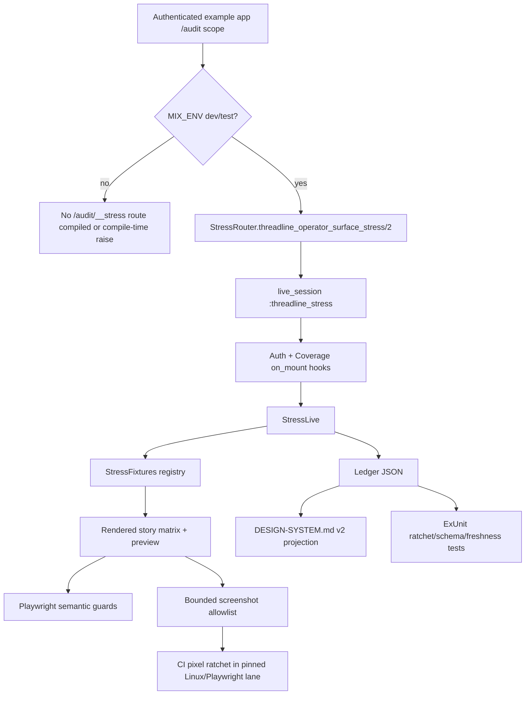

# Phase 171: Audit Baseline, Stress-Lab Harness & Idempotency Ledger - Research

**Researched:** 2026-06-14 [VERIFIED: local date context]  
**Domain:** Phoenix/LiveView operator-surface harness, deterministic fixture registry, JSON design-system ledger, Playwright semantic/pixel guards [VERIFIED: .planning/phases/171-audit-baseline-stress-lab-harness-idempotency-ledger/171-CONTEXT.md]  
**Confidence:** HIGH for architecture and validation shape; MEDIUM for exact file names because planning may refine placement [VERIFIED: codebase grep]

<user_constraints>
## User Constraints (from CONTEXT.md)

### Locked Decisions

### Stress Route Boundary
- **D-01:** Build the stress surface as an internal dev/test-only router/macro, tentatively `Threadline.OperatorSurface.StressRouter.threadline_operator_surface_stress/2`, mounted by the example app adjacent to the real `/audit` surface at `/audit/__stress`.
- **D-02:** Do not add a `stress: true` option to `threadline_operator_surface/2`. The main operator router macro remains the adopter-facing mount API; the stress route is internal harness infrastructure.
- **D-03:** The stress route must reuse the real operator shell/auth/theme path as much as practical: host-owned pipeline, authenticated `/audit` scope, `Auth`/coverage `on_mount` behavior, `data-tl-theme`, and the same inline style/component assets.
- **D-04:** The stress route must fail closed in production. Acceptable mechanisms include compile-time omission or compile-time raise under `MIX_ENV=prod`; planning must include tests proving `/audit/__stress` does not exist in production and is not reachable without the example operator auth path.
- **D-05:** Avoid Phoenix route namespace surprises: use scope-local alias hygiene, `as: false` where applicable, and a stress-specific `live_session` name if adding a second `live_session` would collide with `:threadline`.

### Fixture Source Of Truth
- **D-06:** Use a hybrid fixture model. Static library-side stress fixtures are the canonical source for `/audit/__stress`, DS-04 ugly-data coverage, ledger IDs, and stress screenshots.
- **D-07:** Keep the example-app seeded database as a smaller integration truth lane for real routed pages and workflow screenshots. Do not force every stress state through Ecto rows or example seed data.
- **D-08:** Introduce a plain internal fixture/story registry, tentatively `Threadline.OperatorSurface.StressFixtures`, with stable IDs, categories, scenario names, and assigns/story data that later component phases can reuse. This borrows the useful Storybook/PhoenixStorybook "named variations" idea without adding PhoenixStorybook or any runtime dependency.
- **D-09:** The ugly-data matrix must include the DS-04 cases: empty, one, many, long IDs/strings, non-ASCII, high/zero counts, null fields, error/warning/mixed severity, permission-denied, stale, reconnecting, timezone, and pagination boundaries.
- **D-10:** Fixture adapters must be tested so static stress data does not drift away from the shapes consumed by existing LiveViews and future function components.

### Ledger Shape And Ratchet
- **D-11:** Use a machine-readable JSON sidecar as the ratchet source of truth, with `DESIGN-SYSTEM.md` v2 as the human-reviewed projection.
- **D-12:** The JSON ledger should be stable and deterministic: sorted entries, stable IDs, explicit `kind`/`category`, status, current score, target/ratchet score, stress-route path or story key, fixture key, screenshot baseline refs, notes, and ownership/phase metadata where useful.
- **D-13:** Add ExUnit/source-contract coverage for ledger schema, deterministic ordering, generated markdown freshness, and ratchet semantics. A rerun may raise scores but must not silently lower or delete existing scored items.
- **D-14:** Prefer existing project patterns over new infrastructure: use `Jason` for JSON, custom ExUnit failure messages like `brandbook_token_parity_test.exs`, and a small Mix/check helper only if it keeps `DESIGN-SYSTEM.md` generated and fresh.
- **D-15:** Do not use YAML for the ledger; the project has no YAML parser and ad hoc parsing would be worse than JSON. Do not make an Elixir module the canonical ledger source because design audit data should remain a planning/design-system artifact, not app source truth.

### Screenshot Baseline Policy
- **D-16:** Phase 171 should not pixel-baseline the full component x state x theme x viewport matrix immediately. Create the full manifest/registry, then start with a narrow high-signal CI screenshot allowlist that later phases must expand through the ledger.
- **D-17:** CI screenshot comparison should run in a pinned Linux/Playwright environment so visual failures are actionable and not macOS/Linux/font noise. Local broad screenshots may exist as review artifacts, but they are not the canonical ratchet.
- **D-18:** Full-matrix semantic/computed guards should run in CI before broad pixel coverage exists: route presence/gating, fixture registry completeness, stable IDs, required states, theme attributes, focus/role/aria markers where available, and reduced-motion assumptions.
- **D-19:** Pixel baselines must use deterministic fixtures, reduced motion, explicit viewport/theme naming, masks for dynamic values, and a bounded allowlist owned by the JSON ledger. Later phases promote additional stress cells to CI screenshots; removals require an explicit ledger update and rationale.
- **D-20:** Do not introduce external visual services or Storybook-like dependencies in Phase 171. The harness stays inline, Phoenix/LiveView-native, and repo-local.

### Folded Todos
- **D-21:** `theme-picker-idiomatic-ui` is folded into Phase 171 as a known future stress/ledger case only. Phase 171 should reserve stress/ledger slots for the dark/light/system theme-picker states, but implementation remains Phase 175.
- **D-22:** `coverage-schema-card-declutter` is folded into Phase 171 as a known future stress/ledger case only. Phase 171 should represent the coverage card-in-card nesting footgun in the baseline inventory/ledger, but the layout fix remains Phase 176.
- **D-23:** `transaction-page-left-push-desktop` is folded into Phase 171 as a known future stress/ledger case only. Phase 171 should record the desktop-centering issue as a page-level baseline/ledger item, but the fix remains Phase 178.

### the agent's Discretion
The user explicitly asked for advisor-style research and a cohesive one-shot recommendation, so downstream agents should treat the decisions above as locked unless implementation research finds a concrete codebase blocker. Research/planning may refine names and exact file placement, but should preserve the architecture: internal stress mount, static stress fixtures plus seeded integration lane, JSON ratchet source plus markdown projection, and bounded pinned-CI screenshots expanded by ledger.

### Deferred Ideas (OUT OF SCOPE)
- Implementing the runtime theme picker remains Phase 175.
- Fixing coverage card-in-card nesting remains Phase 176.
- Fixing transaction page desktop centering remains Phase 178.
- Public/host-facing component APIs remain out of scope for v1.37 unless a future milestone explicitly reopens the v1.31 freeze.
</user_constraints>

<phase_requirements>
## Phase Requirements

| ID | Description | Research Support |
|----|-------------|------------------|
| DS-01 | Dev/test-only `/audit/__stress` renders component/group/page fixtures across state x theme x viewport and is prod-gated. [VERIFIED: .planning/REQUIREMENTS.md] | Use an internal Phoenix router macro plus stress LiveView mounted in the example app's existing authenticated `/audit` scope; validate route presence/absence and auth via ExUnit and Playwright. [VERIFIED: lib/threadline/operator_surface/router.ex][CITED: https://phoenix.hexdocs.pm/routing.html] |
| DS-02 | `DESIGN-SYSTEM.md` v2 inventories foundations, primitives, form controls, groups, and pages with status. [VERIFIED: .planning/REQUIREMENTS.md] | Generate or source-check the markdown from the JSON ledger/story registry so the inventory is deterministic and fresh. [VERIFIED: test/threadline/brandbook_token_parity_test.exs] |
| DS-03 | Idempotent audit ledger records per-item score and ratchet rule; guards fail CI on regression. [VERIFIED: .planning/REQUIREMENTS.md] | Store canonical ledger in JSON, parse with existing `Jason`, and test sorted IDs, schema, no silent score decrease, no silent deletion, and markdown projection freshness. [VERIFIED: mix.exs][VERIFIED: mix.lock] |
| DS-04 | Reusable ugly-data fixture library covers empty/one/many/long/non-ASCII/high-zero/null/severity/permission/stale/reconnect/timezone/pagination boundaries. [VERIFIED: .planning/REQUIREMENTS.md] | Implement `StressFixtures` as a static story registry with stable IDs, categories, fixture keys, story assigns, and adapter tests against existing LiveView/component assign shapes. [VERIFIED: .planning/phases/171-audit-baseline-stress-lab-harness-idempotency-ledger/171-CONTEXT.md] |
</phase_requirements>

## Summary

Phase 171 should build a repo-local design-system harness, not a public component platform. The safest plan is to add a separate internal stress router/macro and a small stress LiveView under `lib/threadline/operator_surface/`, then mount it only in the example app's existing authenticated `/audit` scope at `/audit/__stress`. Phoenix routing is macro/compile-time oriented, pipelines are explicitly scoped, and `forward/4` is for forwarding a path prefix to a plug; using normal `live_session` + `live` routes keeps the stress route inspectable and consistent with the current operator surface. [VERIFIED: lib/threadline/operator_surface/router.ex][CITED: https://phoenix.hexdocs.pm/routing.html][CITED: https://phoenix-live-view.hexdocs.pm/live-navigation.html]

The fixture and ledger should be boring by design: static library-side story data is canonical for stress rendering, while the example seeded DB remains the integration lane for real routed workflows. The JSON sidecar should be the machine truth and `DESIGN-SYSTEM.md` v2 should be its human projection, guarded by ExUnit contract tests with the same direct failure-message style already used by `brandbook_token_parity_test.exs` and `style_contract_test.exs`. [VERIFIED: .planning/phases/171-audit-baseline-stress-lab-harness-idempotency-ledger/171-CONTEXT.md][VERIFIED: test/threadline/brandbook_token_parity_test.exs][VERIFIED: test/threadline/operator_surface/style_contract_test.exs]

Screenshot strategy should be a bounded ratchet, not a full visual matrix on day one. Playwright's visual comparison docs state that screenshots differ across OS/browser/platform and should run in the same environment as their baselines; the existing example config already uses reduced motion, named projects, snapshot path templating, and dynamic masks. Therefore Phase 171 should make semantic/computed guards broad, make pixel baselines narrow and ledger-owned, and reserve future screenshot expansion as explicit ledger changes. [CITED: https://playwright.dev/docs/test-snapshots][VERIFIED: examples/threadline_phoenix/e2e/playwright.config.ts][VERIFIED: examples/threadline_phoenix/e2e/tests/operator-screenshot-regression.spec.ts]

**Primary recommendation:** Use `Threadline.OperatorSurface.StressRouter.threadline_operator_surface_stress/2` + `Threadline.OperatorSurface.Live.StressLive` + `Threadline.OperatorSurface.StressFixtures` + a JSON ledger/markdown projection pair, all guarded by named Mix and Playwright checks and no new runtime dependencies. [VERIFIED: .planning/phases/171-audit-baseline-stress-lab-harness-idempotency-ledger/171-CONTEXT.md][VERIFIED: mix.exs]

## Project Constraints (from AGENTS.md)

No root `AGENTS.md` exists in `/Users/jon/projects/threadline`; this was verified with `rg --files -g 'AGENTS.md'`. [VERIFIED: local command]  
`examples/threadline_phoenix/AGENTS.md` exists but applies to the nested example subtree, not the repository root; planners touching example-app files should read it before implementation. [VERIFIED: rg --files]

## Architectural Responsibility Map

| Capability | Primary Tier | Secondary Tier | Rationale |
|------------|--------------|----------------|-----------|
| Stress route gating | Frontend Server (Phoenix Router/LiveView) | Browser | Phoenix router macros define routes at compile time and the existing surface uses host pipelines plus LiveView `on_mount`; browser checks prove reachability but should not own auth. [VERIFIED: lib/threadline/operator_surface/router.ex][CITED: https://phoenix.hexdocs.pm/routing.html][CITED: https://phoenix-live-view.hexdocs.pm/Phoenix.LiveView.html] |
| Stress story rendering | Frontend Server (LiveView/function components) | Browser | Function components and HEEx are Phoenix's shared rendering abstraction, while Playwright verifies rendered semantics and screenshots. [CITED: https://phoenix.hexdocs.pm/components.html][VERIFIED: lib/threadline/operator_surface/live/start_live.ex] |
| Static ugly-data fixtures | Application library | Test layer | Phase decisions lock static library-side fixtures as canonical for stress stories, independent from Ecto rows. [VERIFIED: .planning/phases/171-audit-baseline-stress-lab-harness-idempotency-ledger/171-CONTEXT.md] |
| Ledger ratchet | Repository artifact + ExUnit | CI | The JSON ledger is the machine source of truth and ExUnit guards enforce deterministic schema/ratchet behavior before browser checks. [VERIFIED: .planning/phases/171-audit-baseline-stress-lab-harness-idempotency-ledger/171-CONTEXT.md][VERIFIED: mix.exs] |
| Screenshot baseline allowlist | Browser test harness | CI | Playwright owns screenshot comparison, but the JSON ledger owns which stress cells are allowed into CI pixel coverage. [CITED: https://playwright.dev/docs/test-snapshots][VERIFIED: examples/threadline_phoenix/e2e/playwright.config.ts] |
| `DESIGN-SYSTEM.md` v2 projection | Docs/artifact layer | ExUnit | The markdown inventory is human-reviewed, but freshness must be checked against machine data to avoid drift. [VERIFIED: test/threadline/brandbook_token_parity_test.exs][VERIFIED: .planning/REQUIREMENTS.md] |

## Standard Stack

### Core

| Library | Version | Purpose | Why Standard |
|---------|---------|---------|--------------|
| Phoenix [VERIFIED: mix.lock] | root `1.8.7`; example `1.8.5` [VERIFIED: mix.lock][VERIFIED: examples/threadline_phoenix/mix.lock] | Router macros, scopes, pipelines, mounted LiveViews. [VERIFIED: lib/threadline/operator_surface/router.ex] | Phoenix routing compiles route definitions and scopes pipelines explicitly, which matches compile-time fail-closed stress gating. [CITED: https://phoenix.hexdocs.pm/routing.html] |
| Phoenix LiveView [VERIFIED: mix.lock] | root `1.1.30`; example `1.1.28` [VERIFIED: mix.lock][VERIFIED: examples/threadline_phoenix/mix.lock] | Stress LiveView, `live_session`, `on_mount`, URL-stable selection via params. [VERIFIED: lib/threadline/operator_surface/router.ex] | LiveView `on_mount` runs before disconnected and connected mounts and may halt, which fits auth reuse. [CITED: https://phoenix-live-view.hexdocs.pm/Phoenix.LiveView.html] |
| Plug [VERIFIED: mix.lock] | `1.19.1` locally [VERIFIED: mix.lock] | Host pipelines and auth plugs around the stress scope. [VERIFIED: examples/threadline_phoenix/lib/threadline_phoenix_web/router.ex] | Plug.Builder runs pipelines top-to-bottom and defaults plug option initialization to compile time. [CITED: https://plug.hexdocs.pm/Plug.Builder.html] |
| Jason [VERIFIED: mix.lock] | `1.4.4` [VERIFIED: mix.lock] | Parse and encode ledger JSON deterministically. [VERIFIED: mix.exs] | Already a project dependency, so JSON ledger support needs no new runtime package. [VERIFIED: mix.exs][VERIFIED: mix.lock] |
| Playwright [VERIFIED: package-lock] | `@playwright/test` `1.60.0` installed in example e2e app [VERIFIED: npm ls][VERIFIED: examples/threadline_phoenix/e2e/package-lock.json] | Stress route semantic checks and bounded screenshot comparison. [VERIFIED: examples/threadline_phoenix/e2e/playwright.config.ts] | Existing config already uses reduced motion, snapshot naming, fixed projects, and browser verification aliases. [VERIFIED: examples/threadline_phoenix/e2e/playwright.config.ts][VERIFIED: mix.exs] |

### Supporting

| Library/Tool | Version | Purpose | When to Use |
|--------------|---------|---------|-------------|
| Ecto SQL Sandbox [VERIFIED: mix.lock] | `ecto_sql` `3.13.5` locally; official docs current at `3.14.0` [VERIFIED: mix.lock][CITED: https://ecto-sql.hexdocs.pm/Ecto.Adapters.SQL.Sandbox.html] | Keep integration tests transactional when example DB rows are needed. [VERIFIED: test/support/data_case.ex] | Use for seeded integration lane, but keep canonical stress fixtures static to avoid ownership/process coupling. [CITED: https://ecto-sql.hexdocs.pm/Ecto.Adapters.SQL.Sandbox.html][VERIFIED: .planning/phases/171-audit-baseline-stress-lab-harness-idempotency-ledger/171-CONTEXT.md] |
| lazy_html [VERIFIED: mix.lock] | `0.1.11` [VERIFIED: mix.lock] | Existing test-only HTML parsing support. [VERIFIED: mix.exs] | Use only if a source/render contract benefits from DOM parsing in ExUnit; do not add a new parser. [VERIFIED: mix.exs] |

### Alternatives Considered

| Instead of | Could Use | Tradeoff |
|------------|-----------|----------|
| Internal stress LiveView route | PhoenixStorybook | Rejected by milestone invariant: no PhoenixStorybook and no new runtime dependency. [VERIFIED: .planning/REQUIREMENTS.md][VERIFIED: .planning/phases/171-audit-baseline-stress-lab-harness-idempotency-ledger/171-CONTEXT.md] |
| Normal `live_session`/`live` routes | `forward "/__stress", SomePlug` | `forward/4` is valid for plug/router sharing, but LiveView live navigation works only for router-defined LiveViews and the context specifically warns that `live_session`/forward is not the right shape for this route. [CITED: https://phoenix.hexdocs.pm/routing.html][CITED: https://phoenix-live-view.hexdocs.pm/live-navigation.html][VERIFIED: phase prompt official docs anchors] |
| JSON ledger | YAML ledger | Rejected because the project has `Jason` and no YAML parser; ad hoc YAML parsing would be new infrastructure and more fragile. [VERIFIED: mix.exs][VERIFIED: .planning/phases/171-audit-baseline-stress-lab-harness-idempotency-ledger/171-CONTEXT.md] |
| Static fixtures | Example DB rows for every stress case | Rejected because Ecto sandbox is ownership/transaction based and browser/integration state is a different truth lane; static fixtures are deterministic and reusable by later component phases. [CITED: https://ecto-sql.hexdocs.pm/Ecto.Adapters.SQL.Sandbox.html][VERIFIED: .planning/phases/171-audit-baseline-stress-lab-harness-idempotency-ledger/171-CONTEXT.md] |
| Full pixel matrix immediately | Bounded ledger-owned screenshot allowlist | Full matrix creates noisy CI and baseline sprawl; Playwright warns host OS/rendering differences affect screenshots. [CITED: https://playwright.dev/docs/test-snapshots][VERIFIED: .planning/phases/171-audit-baseline-stress-lab-harness-idempotency-ledger/171-CONTEXT.md] |

**Installation:**

```bash
# No new packages for Phase 171. Use existing Mix and example Playwright dependencies.
mix deps.get
cd examples/threadline_phoenix/e2e && npm ci
```

**Version verification:** `mix deps`, `mix.lock`, `examples/threadline_phoenix/mix.lock`, and `npm ls @playwright/test --depth=0` verified the versions above. [VERIFIED: local command]

## Package Legitimacy Audit

Phase 171 installs no new external packages. [VERIFIED: .planning/REQUIREMENTS.md][VERIFIED: .planning/phases/171-audit-baseline-stress-lab-harness-idempotency-ledger/171-UI-SPEC.md]

| Package | Registry | Age | Downloads | Source Repo | slopcheck | Disposition |
|---------|----------|-----|-----------|-------------|-----------|-------------|
| none | — | — | — | — | slopcheck `0.6.1` available but not needed [VERIFIED: local command] | Approved: no package install |

**Packages removed due to slopcheck [SLOP] verdict:** none. [VERIFIED: no new packages]  
**Packages flagged as suspicious [SUS]:** none. [VERIFIED: no new packages]

## Architecture Patterns

### System Architecture Diagram



Diagram claims reflect the locked architecture and existing router/test harness. [VERIFIED: .planning/phases/171-audit-baseline-stress-lab-harness-idempotency-ledger/171-CONTEXT.md][VERIFIED: lib/threadline/operator_surface/router.ex][VERIFIED: examples/threadline_phoenix/e2e/playwright.config.ts]

### Recommended Project Structure

```text
lib/threadline/operator_surface/
├── stress_router.ex             # internal dev/test-only stress mount macro
├── stress_fixtures.ex           # stable story and ugly-data registry
├── stress_ledger.ex             # JSON load/sort/ratchet/projection helpers, if helper code is needed
└── live/stress_live.ex          # lab route, filters, story detail, preview

test/threadline/operator_surface/
├── stress_router_test.exs       # compile-time prod/dev/test route and auth gate tests
├── stress_fixtures_test.exs     # DS-04 matrix and assign-shape tests
└── stress_ledger_test.exs       # schema/order/ratchet/markdown freshness tests

examples/threadline_phoenix/e2e/tests/
└── operator-stress.spec.ts      # semantic route/lab checks and narrow screenshot allowlist

DESIGN-SYSTEM.md                 # human projection
.planning/design-system-ledger.json
```

The exact ledger JSON path may be refined by planning, but it should be stable, repo-local, and outside app runtime source unless a helper module needs to read it for tests. [VERIFIED: .planning/phases/171-audit-baseline-stress-lab-harness-idempotency-ledger/171-CONTEXT.md][ASSUMED]

### Pattern 1: Internal Stress Router Macro

**What:** Add a separate `StressRouter` module guarded by compile-time environment checks and mounted only in the example app's authenticated `/audit` scope. [VERIFIED: .planning/phases/171-audit-baseline-stress-lab-harness-idempotency-ledger/171-CONTEXT.md]  
**When to use:** Use for `/audit/__stress` only; never add a `stress: true` option to the public `threadline_operator_surface/2` macro. [VERIFIED: .planning/phases/171-audit-baseline-stress-lab-harness-idempotency-ledger/171-CONTEXT.md]

```elixir
# Source: existing Router macro pattern + Phoenix routing docs.
# [VERIFIED: lib/threadline/operator_surface/router.ex][CITED: https://phoenix.hexdocs.pm/routing.html]
defmacro threadline_operator_surface_stress(path, opts \\ []) do
  caller_file = __CALLER__.file
  caller_line = __CALLER__.line

  if Mix.env() == :prod do
    raise CompileError,
      file: caller_file,
      line: caller_line,
      description: "Threadline stress surface is dev/test-only"
  end

  quote do
    import Phoenix.LiveView.Router, only: [live_session: 3, live: 3]

    live_session :threadline_stress,
      on_mount: [
        {Threadline.OperatorSurface.Auth, unquote(opts)},
        {Threadline.OperatorSurface.Coverage.OnMount, unquote(opts)}
      ] do
      scope unquote(path), alias: Threadline.OperatorSurface.Live, as: false do
        live("/", StressLive, :index)
      end
    end
  end
end
```

Planner note: `Mix.env()` inside library macros is acceptable here because the route itself is explicitly dev/test harness infrastructure, but tests must prove production omission/raise behavior. [VERIFIED: .planning/phases/171-audit-baseline-stress-lab-harness-idempotency-ledger/171-CONTEXT.md][CITED: https://plug.hexdocs.pm/Plug.Builder.html]

### Pattern 2: Static Story Registry With Stable IDs

**What:** A plain module returns sorted story maps with `id`, `category`, `fixture_key`, `scenario`, `state`, `theme_modes`, `viewports`, `ledger_id`, and `assigns`. [VERIFIED: .planning/phases/171-audit-baseline-stress-lab-harness-idempotency-ledger/171-CONTEXT.md]  
**When to use:** Use for stress rendering, ledger rows, Playwright selectors, and future component phase reuse. [VERIFIED: .planning/phases/171-audit-baseline-stress-lab-harness-idempotency-ledger/171-CONTEXT.md]

```elixir
# Source: Phase 171 decisions; plain Elixir data avoids new runtime dependencies.
# [VERIFIED: .planning/phases/171-audit-baseline-stress-lab-harness-idempotency-ledger/171-CONTEXT.md]
def all do
  [
    %{
      id: "page.timeline.empty.dark.375",
      category: :page,
      component: Threadline.OperatorSurface.Live.TimelineLive,
      fixture_key: :timeline_empty,
      states: [:empty],
      themes: [:dark, :light, :system],
      viewports: [320, 375, 768, 1024, 1440],
      ledger_id: "PAGE-TIMELINE-EMPTY",
      assigns: timeline_empty_assigns()
    }
  ]
  |> Enum.sort_by(& &1.id)
end
```

Planner note: keep fixtures as inert data and pure adapter functions; do not start Repo processes or depend on browser seed data for DS-04. [CITED: https://ecto-sql.hexdocs.pm/Ecto.Adapters.SQL.Sandbox.html][VERIFIED: .planning/phases/171-audit-baseline-stress-lab-harness-idempotency-ledger/171-CONTEXT.md]

### Pattern 3: JSON Ledger Ratchet

**What:** JSON is canonical; helper/test code decodes, sorts, validates, projects markdown, and blocks silent score decreases/deletions. [VERIFIED: .planning/phases/171-audit-baseline-stress-lab-harness-idempotency-ledger/171-CONTEXT.md][VERIFIED: mix.exs]

```elixir
# Source: existing Jason dependency and brandbook parity test style.
# [VERIFIED: mix.lock][VERIFIED: test/threadline/brandbook_token_parity_test.exs]
ledger = "path/to/ledger.json" |> File.read!() |> Jason.decode!()

entries =
  ledger["entries"]
  |> Enum.sort_by(& &1["id"])

assert entries == ledger["entries"],
       "design-system ledger entries must be sorted by id for deterministic diffs"

for entry <- entries do
  assert is_integer(entry["score"]),
         "ledger #{entry["id"]} must carry an integer score"
end
```

Ratchet tests should compare the current ledger to a checked-in previous/baseline snapshot or generated lock section and fail when an existing ID disappears or `score` drops without an explicit reset field. [VERIFIED: .planning/phases/171-audit-baseline-stress-lab-harness-idempotency-ledger/171-CONTEXT.md][ASSUMED]

### Pattern 4: URL-Stable Stress Lab Selection

**What:** Use query params or path segments for selected category/story so a reviewer can link directly to a stress cell. [VERIFIED: .planning/phases/171-audit-baseline-stress-lab-harness-idempotency-ledger/171-UI-SPEC.md]  
**Why:** LiveView docs state `handle_params/3` is invoked after mount and on patch, and should validate user-controlled params. [CITED: https://phoenix-live-view.hexdocs.pm/live-navigation.html]

```elixir
# Source: Phoenix LiveView live-navigation docs.
# [CITED: https://phoenix-live-view.hexdocs.pm/live-navigation.html]
def handle_params(params, _uri, socket) do
  selected_id = normalize_story_id(params["story"])
  {:noreply, assign(socket, :selected_story_id, selected_id)}
end
```

### Anti-Patterns to Avoid

- **Public option creep:** Do not add `stress: true` to `threadline_operator_surface/2`; this would turn internal harness wiring into adopter API surface. [VERIFIED: .planning/phases/171-audit-baseline-stress-lab-harness-idempotency-ledger/171-CONTEXT.md]
- **Forwarding the stress route:** Do not use `forward` for the LiveView lab; router-defined LiveViews are the documented path for live navigation and introspection. [CITED: https://phoenix.hexdocs.pm/routing.html][CITED: https://phoenix-live-view.hexdocs.pm/live-navigation.html]
- **Fixture DB coupling:** Do not force the ugly-data matrix through seeded Ecto rows; SQL Sandbox is ownership/transaction based and browser flows introduce process boundaries. [CITED: https://ecto-sql.hexdocs.pm/Ecto.Adapters.SQL.Sandbox.html]
- **Screenshot-only quality:** Do not claim DS-01/DS-03 from pixel baselines alone; semantic route/auth/fixture/aria/theme checks must cover the full matrix before broad pixels exist. [VERIFIED: .planning/phases/171-audit-baseline-stress-lab-harness-idempotency-ledger/171-CONTEXT.md][CITED: https://playwright.dev/docs/test-snapshots]
- **Markdown as truth:** Do not make `DESIGN-SYSTEM.md` the ratchet source; markdown is the reviewed projection and JSON is the machine ledger. [VERIFIED: .planning/phases/171-audit-baseline-stress-lab-harness-idempotency-ledger/171-CONTEXT.md]
- **Theme regressions by omission:** Do not render stress pages outside `.threadline-ui` or without `data-tl-theme`; every current operator LiveView renders this wrapper and inline CSS. [VERIFIED: rg data-tl-theme lib/threadline/operator_surface]

## Don't Hand-Roll

| Problem | Don't Build | Use Instead | Why |
|---------|-------------|-------------|-----|
| JSON parsing | Custom parser or string regexes | `Jason` [VERIFIED: mix.lock] | Existing dependency, predictable encode/decode, no new runtime package. [VERIFIED: mix.exs][VERIFIED: mix.lock] |
| Router auth boundary | Browser-only checks or route comments | Phoenix pipelines + LiveView `on_mount` | Existing mount already secures via host pipeline and `Threadline.OperatorSurface.Auth`; LiveView hooks run before mount and may halt. [VERIFIED: lib/threadline/operator_surface/router.ex][CITED: https://phoenix-live-view.hexdocs.pm/Phoenix.LiveView.html] |
| Component rendering DSL | Storybook clone or custom asset pipeline | Phoenix LiveView + function components | Phoenix function components are the shared HTML rendering abstraction; milestone bans PhoenixStorybook and asset pipeline. [CITED: https://phoenix.hexdocs.pm/components.html][VERIFIED: .planning/REQUIREMENTS.md] |
| Browser visual diffs | Image diff scripts | Playwright `toHaveScreenshot` | Existing dependency and config; official docs cover baseline generation, updates, platform sensitivity, masks/style options. [CITED: https://playwright.dev/docs/test-snapshots][VERIFIED: examples/threadline_phoenix/e2e/playwright.config.ts] |
| DB-backed stress isolation | Custom transaction/process sharing | Static fixtures plus Ecto Sandbox only for integration lane | Ecto Sandbox has explicit ownership/allowance rules; static fixtures avoid cross-process test state. [CITED: https://ecto-sql.hexdocs.pm/Ecto.Adapters.SQL.Sandbox.html] |

**Key insight:** Phase 171 is an idempotency foundation. Custom visual infrastructure, DB-backed fixture factories, and public route options add surprise exactly where later phases need deterministic, boring, inspectable contracts. [VERIFIED: .planning/phases/171-audit-baseline-stress-lab-harness-idempotency-ledger/171-CONTEXT.md]

## Common Pitfalls

### Pitfall 1: Route Exists In Production
**What goes wrong:** `/audit/__stress` becomes reachable in production or appears in production routes. [VERIFIED: .planning/REQUIREMENTS.md]  
**Why it happens:** The stress route is mounted unconditionally or guarded only by runtime checks in the LiveView. [ASSUMED]  
**How to avoid:** Compile-time omit or compile-time raise under `MIX_ENV=prod`, and test route absence with a compiled throwaway router or example router route inspection. [VERIFIED: .planning/phases/171-audit-baseline-stress-lab-harness-idempotency-ledger/171-CONTEXT.md][CITED: https://phoenix.hexdocs.pm/routing.html]  
**Warning signs:** `mix phx.routes` or `Phoenix.Router.routes/1` shows `/audit/__stress` in prod, or unauthenticated browser navigation reaches any stress HTML. [CITED: https://phoenix.hexdocs.pm/routing.html][ASSUMED]

### Pitfall 2: `live_session :threadline` Collision
**What goes wrong:** The stress macro defines another `live_session :threadline` or pipeline name that collides with the existing operator macro. [VERIFIED: lib/threadline/operator_surface/router.ex]  
**Why it happens:** Copying `threadline_operator_surface/2` without changing session/pipeline names. [VERIFIED: lib/threadline/operator_surface/router.ex]  
**How to avoid:** Use `:threadline_stress` and stress-specific pipeline names if any are added. [VERIFIED: .planning/phases/171-audit-baseline-stress-lab-harness-idempotency-ledger/171-CONTEXT.md]  
**Warning signs:** Router compilation fails when both `/audit` and `/audit/__stress` are mounted. [ASSUMED]

### Pitfall 3: Static Fixtures Drift From LiveView Assign Shapes
**What goes wrong:** Stress stories render fake data that no real page/component consumes. [VERIFIED: .planning/phases/171-audit-baseline-stress-lab-harness-idempotency-ledger/171-CONTEXT.md]  
**Why it happens:** Fixture maps are invented without adapter tests against existing LiveView render assumptions. [ASSUMED]  
**How to avoid:** Add fixture adapter tests that call story adapters and render representative HEEx/function components where possible. [VERIFIED: .planning/phases/171-audit-baseline-stress-lab-harness-idempotency-ledger/171-CONTEXT.md][CITED: https://phoenix.hexdocs.pm/components.html]  
**Warning signs:** Stress pages pass while actual `/audit` pages fail under equivalent empty/error/permission states. [ASSUMED]

### Pitfall 4: Ledger Diff Noise
**What goes wrong:** JSON order changes on every generation or markdown projection changes without semantic ledger changes. [VERIFIED: .planning/phases/171-audit-baseline-stress-lab-harness-idempotency-ledger/171-CONTEXT.md]  
**Why it happens:** Entries are appended ad hoc or maps are encoded without sorted entries and stable field order. [ASSUMED]  
**How to avoid:** Sort entries by `id`, use stable field order in generator output, and test the generated markdown is fresh. [VERIFIED: test/threadline/brandbook_token_parity_test.exs][ASSUMED]  
**Warning signs:** Review diffs show row reordering or timestamp churn unrelated to score/story changes. [ASSUMED]

### Pitfall 5: Visual Baselines Become CI Noise
**What goes wrong:** Pixel tests fail because OS/font/rendering environment differs, not because the UI regressed. [CITED: https://playwright.dev/docs/test-snapshots]  
**Why it happens:** Baselines generated locally are asserted in a different CI environment or broad full-page screenshots include dynamic text/timestamps. [CITED: https://playwright.dev/docs/test-snapshots][VERIFIED: examples/threadline_phoenix/e2e/tests/operator-screenshot-regression.spec.ts]  
**How to avoid:** Use a pinned Linux Playwright lane, reduced motion, explicit viewport/theme naming, masks/stylePath for volatility, and a ledger-owned allowlist. [CITED: https://playwright.dev/docs/test-snapshots][VERIFIED: examples/threadline_phoenix/e2e/playwright.config.ts]  
**Warning signs:** Tests need frequent `--update-snapshots` without intentional UI changes. [ASSUMED]

### Pitfall 6: Stress Lab Feels Like A Marketing Gallery
**What goes wrong:** The first screen becomes a demo/storybook clone instead of an internal operator lab. [VERIFIED: .planning/phases/171-audit-baseline-stress-lab-harness-idempotency-ledger/171-UI-SPEC.md]  
**Why it happens:** New visual language, decorative cards, or generic SaaS copy is introduced. [VERIFIED: brandbook/brand-book.md][VERIFIED: .planning/phases/171-audit-baseline-stress-lab-harness-idempotency-ledger/171-UI-SPEC.md]  
**How to avoid:** Reuse real shell, `.threadline-ui`, `data-tl-theme`, Geist/IBM Plex Mono roles, existing tokens, and exact lab nouns: stress story, fixture, ledger item, ratchet, audit coverage. [VERIFIED: .planning/phases/171-audit-baseline-stress-lab-harness-idempotency-ledger/171-UI-SPEC.md][VERIFIED: brandbook/brand-book.md]  
**Warning signs:** Copy uses "powerful", "seamless", "robust", "compliance suite", or similar banned/generic language. [VERIFIED: brandbook/brand-book.md][VERIFIED: .planning/phases/171-audit-baseline-stress-lab-harness-idempotency-ledger/171-UI-SPEC.md]

## Code Examples

### ExUnit Route Gate Shape

```elixir
# Source: existing router macro tests.
# [VERIFIED: test/threadline/operator_surface/router_test.exs]
test "stress macro raises in prod" do
  previous = Mix.env()

  try do
    # Planner should prefer a helper that compiles a throwaway router under prod
    # semantics without permanently changing global test state.
    assert_raise CompileError, ~r/stress surface is dev\/test-only/, fn ->
      Code.compile_quoted(quoted_prod_stress_router())
    end
  after
    _ = previous
  end
end
```

### Playwright Semantic Guard Shape

```typescript
// Source: existing Playwright auth and semantic checks.
// [VERIFIED: examples/threadline_phoenix/e2e/tests/operator-accessibility.spec.ts]
test("stress lab is authenticated and exposes stable story metadata", async ({ page }) => {
  await login(page);
  await page.goto("/audit/__stress?story=page.timeline.empty.dark.375");
  await expect(page.getByTestId("operator-header")).toBeVisible();
  await expect(page.locator(".threadline-ui")).toHaveAttribute("data-tl-theme", /dark|light|system/);
  await expect(page.getByRole("heading", { name: /stress/i })).toBeVisible();
  await expect(page.getByTestId("stress-story-id")).toHaveText("page.timeline.empty.dark.375");
});
```

### Bounded Screenshot Guard Shape

```typescript
// Source: Playwright visual comparison docs and existing regression guard.
// [CITED: https://playwright.dev/docs/test-snapshots][VERIFIED: examples/threadline_phoenix/e2e/tests/operator-screenshot-regression.spec.ts]
await expect(page.getByTestId("stress-preview")).toHaveScreenshot("stress-page-timeline-empty.png", {
  maxDiffPixelRatio: 0.01,
  mask: [
    page.locator("time"),
    page.locator("[data-dynamic='true']"),
  ],
});
```

## State of the Art

| Old Approach | Current Approach | When Changed | Impact |
|--------------|------------------|--------------|--------|
| Full Storybook-style component explorer | Inline Phoenix/LiveView-native stress lab | Locked by Phase 171 context on 2026-06-14 [VERIFIED: 171-CONTEXT.md] | Keeps the OSS library zero-runtime-dependency and avoids public component API pressure. [VERIFIED: .planning/REQUIREMENTS.md] |
| Local-only screenshot regression | Bounded CI screenshot allowlist plus semantic guards | Phase 171 should introduce this [VERIFIED: 171-CONTEXT.md] | Pixel coverage becomes actionable while broad coverage remains semantic until promoted. [CITED: https://playwright.dev/docs/test-snapshots] |
| Human-maintained design inventory | JSON ledger with generated/fresh markdown projection | Phase 171 should introduce this [VERIFIED: 171-CONTEXT.md] | Later phases can ratchet scores idempotently and reviewers still get readable `DESIGN-SYSTEM.md`. [VERIFIED: .planning/REQUIREMENTS.md] |
| Seeded DB as demo truth | Static stress fixture registry plus seeded integration lane | Phase 171 should introduce this [VERIFIED: 171-CONTEXT.md] | Stress matrix becomes deterministic and reusable without abandoning real example workflows. [CITED: https://ecto-sql.hexdocs.pm/Ecto.Adapters.SQL.Sandbox.html] |

**Deprecated/outdated:**
- `threadline_operator_surface/2` option expansion for stress behavior is rejected by D-02. [VERIFIED: .planning/phases/171-audit-baseline-stress-lab-harness-idempotency-ledger/171-CONTEXT.md]
- YAML ledger is rejected by D-15. [VERIFIED: .planning/phases/171-audit-baseline-stress-lab-harness-idempotency-ledger/171-CONTEXT.md]
- PhoenixStorybook or external visual services are rejected by D-20 and milestone invariants. [VERIFIED: .planning/phases/171-audit-baseline-stress-lab-harness-idempotency-ledger/171-CONTEXT.md][VERIFIED: .planning/REQUIREMENTS.md]

## Assumptions Log

| # | Claim | Section | Risk if Wrong |
|---|-------|---------|---------------|
| A1 | Suggested ledger path `.planning/design-system-ledger.json` is a good default. | Recommended Project Structure | Planner may choose a different repo-local path; downstream references must stay consistent. |
| A2 | A previous/baseline snapshot or lock section is the simplest ratchet comparison mechanism. | Pattern 3 | Planner may prefer git-diff-based ratchet or explicit reset records; tests must still block silent score drops/deletions. |
| A3 | Router warning signs can be detected by route introspection or `mix phx.routes` in implementation tests. | Common Pitfalls | Exact example-app production route test mechanics may need adjustment for Mix env compile behavior. |
| A4 | Fixture drift can be caught by rendering representative components/LiveViews directly in ExUnit. | Common Pitfalls | Some page-level LiveViews may require adapter seams before isolated render tests are ergonomic. |
| A5 | Snapshot churn warning signs imply insufficient masking/environment pinning. | Common Pitfalls | A legitimate UI change can also require snapshot updates; ledger rationale should distinguish those. |

## Open Questions

1. **Where should the JSON ledger live?**
   - What we know: JSON is the canonical ratchet source, markdown is projection, and repo-local deterministic diffs are required. [VERIFIED: .planning/phases/171-audit-baseline-stress-lab-harness-idempotency-ledger/171-CONTEXT.md]
   - What's unclear: The exact path is not locked. [VERIFIED: .planning/phases/171-audit-baseline-stress-lab-harness-idempotency-ledger/171-CONTEXT.md]
   - Recommendation: Use `.planning/design-system-ledger.json` or `.planning/design-system/ledger.json` if the planner wants planning artifacts grouped; keep `DESIGN-SYSTEM.md` at repo root for discoverability. [ASSUMED]

2. **How hard should the first CI screenshot lane be?**
   - What we know: Full matrix pixels are out; a narrow high-signal allowlist is in. [VERIFIED: .planning/phases/171-audit-baseline-stress-lab-harness-idempotency-ledger/171-CONTEXT.md]
   - What's unclear: The exact first allowlist size is not specified. [VERIFIED: .planning/phases/171-audit-baseline-stress-lab-harness-idempotency-ledger/171-CONTEXT.md]
   - Recommendation: Start with 2-4 cells: shell/home happy state, timeline empty/ugly long IDs, permission-denied, and one future reserved footgun; require ledger entries for each. [ASSUMED]

## Environment Availability

| Dependency | Required By | Available | Version | Fallback |
|------------|-------------|-----------|---------|----------|
| Elixir | Root ExUnit/Mix aliases | yes [VERIFIED: local command] | 1.19.5 / OTP 28 [VERIFIED: local command] | None needed |
| Mix | ExUnit, compile, aliases | yes [VERIFIED: local command] | 1.19.5 [VERIFIED: local command] | None needed |
| Node.js | Playwright e2e | yes [VERIFIED: local command] | v22.14.0 [VERIFIED: local command] | None needed |
| npm | Playwright dependency install | yes [VERIFIED: local command] | 11.1.0 [VERIFIED: local command] | None needed |
| PostgreSQL client | Example app DB checks | yes [VERIFIED: local command] | psql 14.17 [VERIFIED: local command] | Static fixture tests cover most Phase 171 logic if DB unavailable |
| Docker | Pinned/browser or local demo lanes | yes [VERIFIED: local command] | 29.5.2 [VERIFIED: local command] | Local Playwright can run without Docker, but CI pixel pinning needs container/CI image |
| Playwright | Browser semantic/pixel checks | yes [VERIFIED: npm ls] | `@playwright/test` 1.60.0 [VERIFIED: npm ls] | ExUnit semantic checks for non-browser parts |
| slopcheck | Package legitimacy | yes [VERIFIED: local command] | 0.6.1 [VERIFIED: local command] | Not needed because no new packages |

**Missing dependencies with no fallback:** none found for research. [VERIFIED: local command]  
**Missing dependencies with fallback:** PostgreSQL server availability was not probed; DS-01/DS-03/DS-04 core can be planned around static fixtures and root tests, while example browser checks still require the existing example DB bootstrap. [ASSUMED][VERIFIED: mix.exs]

## Validation Architecture

### Test Framework

| Property | Value |
|----------|-------|
| Framework | ExUnit via Mix plus Playwright Test 1.60.0 for browser guards. [VERIFIED: mix.exs][VERIFIED: examples/threadline_phoenix/e2e/package-lock.json] |
| Config file | Root `mix.exs`; example browser `examples/threadline_phoenix/e2e/playwright.config.ts`. [VERIFIED: mix.exs][VERIFIED: examples/threadline_phoenix/e2e/playwright.config.ts] |
| Quick run command | `mix test test/threadline/operator_surface/stress_router_test.exs test/threadline/operator_surface/stress_fixtures_test.exs test/threadline/operator_surface/stress_ledger_test.exs` [ASSUMED] |
| Full suite command | `mix ci.all` plus the new stress browser spec through `mix verify.example_browser -- --grep @stress` if planner adds grep tagging, otherwise `mix verify.example_browser`. [VERIFIED: mix.exs][ASSUMED] |

### Phase Requirements -> Test Map

| Req ID | Behavior | Test Type | Automated Command | File Exists? |
|--------|----------|-----------|-------------------|--------------|
| DS-01 | `/audit/__stress` exists in dev/test example route, reuses auth shell/theme, and is absent or compile-blocked in prod. [VERIFIED: .planning/REQUIREMENTS.md] | ExUnit router compile contract + Playwright auth/semantic smoke | `mix test test/threadline/operator_surface/stress_router_test.exs` and `mix verify.example_browser -- operator-stress.spec.ts` [ASSUMED] | no, Wave 0 |
| DS-02 | `DESIGN-SYSTEM.md` v2 inventories foundations, primitives, controls, groups, pages, statuses and is fresh from ledger/registry. [VERIFIED: .planning/REQUIREMENTS.md] | ExUnit source/doc contract | `mix test test/threadline/operator_surface/stress_ledger_test.exs` [ASSUMED] | no, Wave 0 |
| DS-03 | JSON ledger schema/order/ratchet blocks silent score decreases and deletions; screenshot allowlist matches ledger. [VERIFIED: .planning/REQUIREMENTS.md] | ExUnit source contract + Playwright bounded screenshot | `mix test test/threadline/operator_surface/stress_ledger_test.exs` and `mix verify.example_browser -- operator-stress.spec.ts` [ASSUMED] | no, Wave 0 |
| DS-04 | Static fixture registry covers empty/one/many/long/non-ASCII/high-zero/null/severity/permission/stale/reconnect/timezone/pagination boundaries. [VERIFIED: .planning/REQUIREMENTS.md] | ExUnit fixture registry contract + stress LiveView semantic smoke | `mix test test/threadline/operator_surface/stress_fixtures_test.exs` [ASSUMED] | no, Wave 0 |

### Sampling Rate

- **Per task commit:** Run the relevant new ExUnit file plus `mix test test/threadline/operator_surface/router_test.exs test/threadline/operator_surface/style_contract_test.exs`. [VERIFIED: existing tests][ASSUMED]
- **Per wave merge:** Run `mix test test/threadline/operator_surface/stress_router_test.exs test/threadline/operator_surface/stress_fixtures_test.exs test/threadline/operator_surface/stress_ledger_test.exs` and the new Playwright stress spec. [ASSUMED]
- **Phase gate:** Run `mix ci.all`; run `mix verify.example_browser_light` if stress route supports the system/light lane in this phase or if the planner touches example theme compilation. [VERIFIED: mix.exs][ASSUMED]

### Acceptance Proof Types

| Req ID | Acceptance Proof |
|--------|------------------|
| DS-01 | ExUnit compile/route introspection proves prod absence/raise and dev/test presence; Playwright proves unauthenticated redirect/forbidden path and authenticated stress page with `operator-header`, `.threadline-ui`, `data-tl-theme`, keyboard-reachable navigation, and no horizontal overflow at selected viewports. [VERIFIED: existing Playwright patterns][ASSUMED] |
| DS-02 | `DESIGN-SYSTEM.md` exists, contains required inventory classes, and a freshness test fails if JSON/registry projection differs. [VERIFIED: test/threadline/brandbook_token_parity_test.exs][ASSUMED] |
| DS-03 | Ledger tests fail on unsorted entries, missing required fields, deleted existing IDs, score decreases, missing screenshot allowlist references, or markdown drift. [VERIFIED: .planning/phases/171-audit-baseline-stress-lab-harness-idempotency-ledger/171-CONTEXT.md][ASSUMED] |
| DS-04 | Fixture tests enumerate every required ugly-data class and prove each fixture has stable `id`, `fixture_key`, `ledger_id`, category, state, theme metadata, viewport metadata, and renderable assign adapter. [VERIFIED: .planning/REQUIREMENTS.md][ASSUMED] |

### Wave 0 Gaps

- [ ] `test/threadline/operator_surface/stress_router_test.exs` — covers DS-01. [ASSUMED]
- [ ] `test/threadline/operator_surface/stress_fixtures_test.exs` — covers DS-04 and fixture/assign drift. [ASSUMED]
- [ ] `test/threadline/operator_surface/stress_ledger_test.exs` — covers DS-02 and DS-03. [ASSUMED]
- [ ] `examples/threadline_phoenix/e2e/tests/operator-stress.spec.ts` — covers rendered route semantics, auth, theme metadata, viewport smoke, and bounded screenshot allowlist. [ASSUMED]
- [ ] Optional Mix alias `verify.operator_stress` or extension of `verify.example_browser` — useful if planner wants a named phase gate. [VERIFIED: prompts/threadline-elixir-oss-dna.md][ASSUMED]

## Security Domain

### Applicable ASVS Categories

| ASVS Category | Applies | Standard Control |
|---------------|---------|------------------|
| V2 Authentication | yes | Host-owned `:browser`, `:operator_browser`, and `:operator_auth` pipelines plus `Threadline.OperatorSurface.Auth.on_mount`. [VERIFIED: examples/threadline_phoenix/lib/threadline_phoenix_web/router.ex][VERIFIED: lib/threadline/operator_surface/auth.ex] |
| V3 Session Management | yes | Existing Phoenix session flow passes `threadline_current_user` into LiveView auth; stress route must reuse the same path. [VERIFIED: examples/threadline_phoenix/lib/threadline_phoenix_web/router.ex][VERIFIED: lib/threadline/operator_surface/auth.ex] |
| V4 Access Control | yes | Stress route must be inside the authenticated `/audit` scope and absent/blocked in prod. [VERIFIED: .planning/REQUIREMENTS.md][VERIFIED: .planning/phases/171-audit-baseline-stress-lab-harness-idempotency-ledger/171-CONTEXT.md] |
| V5 Input Validation | yes | Validate `story`, `category`, `status`, `theme`, and filter params against registry allowlists in `handle_params/3`; LiveView docs warn params are user-controlled. [CITED: https://phoenix-live-view.hexdocs.pm/live-navigation.html] |
| V6 Cryptography | no direct cryptographic work | Do not introduce crypto or secret handling in Phase 171; use existing session/auth mechanisms only. [VERIFIED: .planning/REQUIREMENTS.md] |

### Known Threat Patterns for Phoenix/LiveView Stress Harness

| Pattern | STRIDE | Standard Mitigation |
|---------|--------|---------------------|
| Accidental prod exposure of internal lab | Information Disclosure / Elevation of Privilege | Compile-time omission/raise under prod plus route absence test. [VERIFIED: .planning/phases/171-audit-baseline-stress-lab-harness-idempotency-ledger/171-CONTEXT.md] |
| LiveView navigation bypasses plug assumptions | Elevation of Privilege | Keep `on_mount` auth on the stress `live_session`; official docs state `on_mount` runs before disconnected and connected mounts and may halt. [CITED: https://phoenix-live-view.hexdocs.pm/Phoenix.LiveView.html] |
| User-controlled story/filter params crash rendering | Denial of Service | Normalize against registry IDs, default safely, and render an explicit not-found/empty lab state. [CITED: https://phoenix-live-view.hexdocs.pm/live-navigation.html][VERIFIED: .planning/phases/171-audit-baseline-stress-lab-harness-idempotency-ledger/171-UI-SPEC.md] |
| Fixture data accidentally includes real secrets | Information Disclosure | Keep fixtures synthetic, static, and source-reviewed; do not bind stress stories to live database rows. [VERIFIED: .planning/phases/171-audit-baseline-stress-lab-harness-idempotency-ledger/171-CONTEXT.md] |
| Ledger reset hides regression | Tampering / Repudiation | Tests block silent score decrease/deletion and require explicit reset/rationale fields. [VERIFIED: .planning/phases/171-audit-baseline-stress-lab-harness-idempotency-ledger/171-CONTEXT.md] |

## Sources

### Primary (HIGH confidence)

- `.planning/phases/171-audit-baseline-stress-lab-harness-idempotency-ledger/171-CONTEXT.md` — locked implementation decisions, fixture/ledger/screenshot policy. [VERIFIED: required file read]
- `.planning/phases/171-audit-baseline-stress-lab-harness-idempotency-ledger/171-UI-SPEC.md` — approved stress lab UI/accessibility/copy contract. [VERIFIED: required file read]
- `.planning/REQUIREMENTS.md` — DS-01 through DS-04 and milestone invariants. [VERIFIED: required file read]
- `.planning/ROADMAP.md` — Phase 171 goal and success criteria. [VERIFIED: required file read]
- `.planning/STATE.md` — milestone history and carried todos. [VERIFIED: required file read]
- `lib/threadline/operator_surface/router.ex`, `auth.ex`, `style.ex`, existing LiveViews/components — current operator-surface routing/auth/theme/rendering patterns. [VERIFIED: codebase grep]
- `test/threadline/operator_surface/router_test.exs`, `style_contract_test.exs`, `brandbook_token_parity_test.exs` — existing contract-test style. [VERIFIED: codebase grep]
- `examples/threadline_phoenix/e2e/playwright.config.ts` and existing Playwright specs — browser verification patterns. [VERIFIED: codebase grep]
- Phoenix routing docs — scopes, pipelines, forward, route inspection concepts. [CITED: https://phoenix.hexdocs.pm/routing.html]
- Phoenix LiveView docs — `on_mount`, live navigation, `handle_params`. [CITED: https://phoenix-live-view.hexdocs.pm/Phoenix.LiveView.html][CITED: https://phoenix-live-view.hexdocs.pm/live-navigation.html]
- Phoenix Components docs — function components and HEEx. [CITED: https://phoenix.hexdocs.pm/components.html]
- Plug.Builder docs — pipeline order and compile-time `init_mode` default. [CITED: https://plug.hexdocs.pm/Plug.Builder.html]
- Ecto SQL Sandbox docs — ownership/transaction model. [CITED: https://ecto-sql.hexdocs.pm/Ecto.Adapters.SQL.Sandbox.html]
- Playwright visual comparison docs — screenshot baseline generation, platform sensitivity, options. [CITED: https://playwright.dev/docs/test-snapshots]

### Secondary (MEDIUM confidence)

- `brandbook/brand-book.md` and `brandbook/pressure-test.md` — brand voice and mechanical design-quality posture. [VERIFIED: codebase grep]
- `prompts/threadline-elixir-oss-dna.md` — project preference for named verification entrypoints and contract-driven OSS DX. [VERIFIED: codebase grep]

### Tertiary (LOW confidence)

- No unverified web-only sources were used for recommendations. [VERIFIED: source list]

## Metadata

**Confidence breakdown:**
- Standard stack: HIGH — versions verified from lockfiles/local commands, and no new packages are recommended. [VERIFIED: mix.lock][VERIFIED: npm ls]
- Architecture: HIGH — phase decisions are locked and align with current router/auth/theme code plus official Phoenix/LiveView docs. [VERIFIED: 171-CONTEXT.md][CITED: https://phoenix.hexdocs.pm/routing.html][CITED: https://phoenix-live-view.hexdocs.pm/Phoenix.LiveView.html]
- Pitfalls: MEDIUM-HIGH — route/auth/screenshot pitfalls are verified by docs and existing code; exact ratchet implementation mechanics remain planner choice. [CITED: https://playwright.dev/docs/test-snapshots][VERIFIED: test/threadline/operator_surface/router_test.exs][ASSUMED]

**Research date:** 2026-06-14 [VERIFIED: local date context]  
**Valid until:** 2026-07-14 for architecture and project constraints; re-check Playwright/Phoenix docs if dependency versions change. [ASSUMED]

