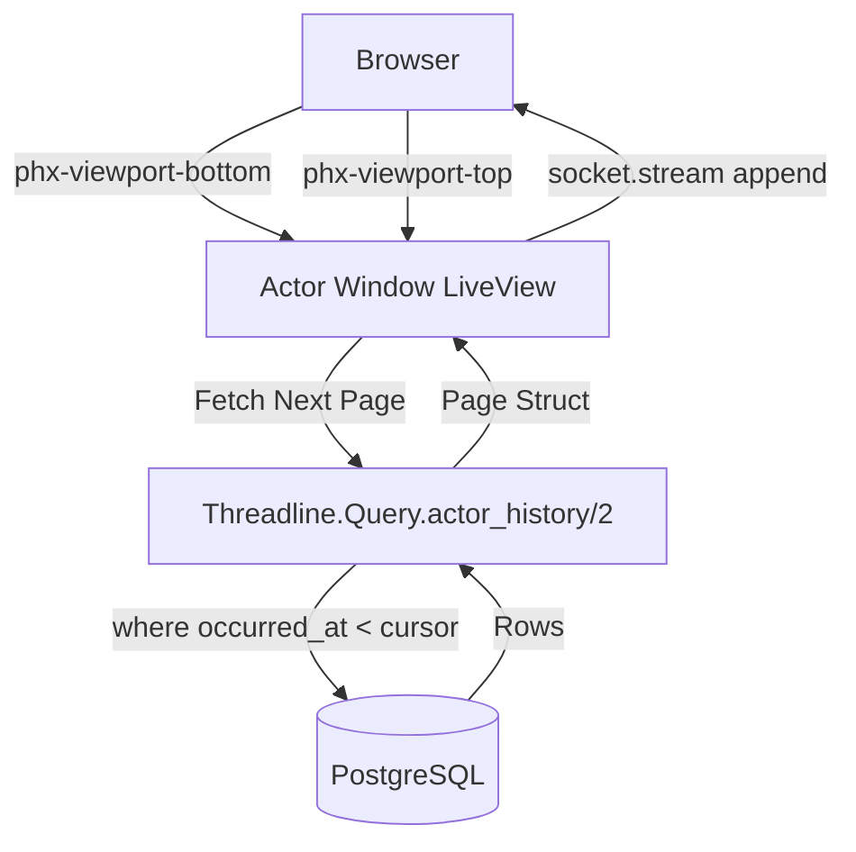

# Phase 60: Actor Window Screen - Research

**Researched:** 2024-05-24
**Domain:** Elixir/Phoenix LiveView observability UI and Keyset Pagination
**Confidence:** HIGH

## Summary

This research targets Phase 60, focusing on keyset pagination and Phoenix LiveView Streams for rendering high-volume transaction timelines without exhausting server memory. `Threadline.Query.actor_history/2` currently fetches all transactions eagerly. We need to introduce an expanded `actor_history/2` API (or a new `actor_history_page/2` function like we did for `timeline_page/2`) that handles keyset cursor paging (`:after`, `:before`) and bounded time ranges (`:from`, `:to`). 

The UI will rely on Phoenix LiveView `stream`s, leveraging `phx-viewport-top` and `phx-viewport-bottom` for seamless bidirectional infinite scrolling, similar to the Datadog log viewer.

**Primary recommendation:** Expand `Threadline.Query.actor_history/2` to return a paginated struct when `:limit` or cursors are provided, and use LiveView streams with bidirectional keyset cursors to manage frontend rendering.

<user_constraints>
## User Constraints (from CONTEXT.md)

### Locked Decisions
1. Pagination Strategy: Keyset Pagination + LiveView Streams.
2. API Contract Update (`Threadline.actor_history/2`): Expand options to support bounded, cursor-based fetching (`:limit`, `:before`/`:after` cursors, `:from`/`:to` boundaries).
3. Time-Window Picker Default: Default to Last 24 Hours.
4. Empty State UX: Distinct empty states.

### the agent's Discretion
None

### Deferred Ideas (OUT OF SCOPE)
None
</user_constraints>

<phase_requirements>
## Phase Requirements

| ID | Description | Research Support |
|----|-------------|------------------|
| UI-02 | Visiting `/audit/actors/:kind/:id` renders a paged transaction list for that actor with a time-window picker. | Requires LiveView Streams and `actor_history/2` keyset pagination parameters. |
</phase_requirements>

## Architectural Responsibility Map

| Capability | Primary Tier | Secondary Tier | Rationale |
|------------|-------------|----------------|-----------|
| Transaction Querying | API / Backend | Database | `Threadline.Query` handles cursor-based SQL queries against `AuditTransaction`. |
| Memory Management | Frontend Server (SSR) | — | Phoenix LiveView Streams (`phx-update="stream"`) keeps server memory bounded. |
| Viewport Tracking | Browser / Client | Frontend Server (SSR) | JS interop via `phx-viewport-*` detects scroll edges and fires LiveView events. |

## Standard Stack

### Core
| Library | Version | Purpose | Why Standard |
|---------|---------|---------|--------------|
| Phoenix LiveView | Current | UI Rendering | Project standard for `Threadline.OperatorSurface.Live`. Provides Streams. |
| Ecto | Current | Database queries | Project standard for PostgreSQL querying. Provides `limit`, `where` for cursors. |

## Architecture Patterns

### System Architecture Diagram



### Pattern 1: LiveView Bidirectional Streams
**What:** Using Phoenix LiveView Streams for infinite scroll without holding memory.
**When to use:** Paginating high-volume log or transaction data.
**Example:**
```elixir
# In LiveView Mount
socket = stream(socket, :transactions, page.entries)

# In Handle Event
def handle_event("next-page", _, socket) do
  last_item = List.last(socket.assigns.streams.transactions.inserts)
  page = Threadline.actor_history(actor, after: build_cursor(last_item))
  {:noreply, stream(socket, :transactions, page.entries, at: -1)}
end
```

### Anti-Patterns to Avoid
- **Offset Pagination:** Using `OFFSET` in SQL causes full-table scans for deep pages and breaks when concurrent inserts happen. Must use `id` and `occurred_at` as keyset cursors.
- **Eager Loading:** Loading the entire history array into memory will cause OOM crashes on high-volume actors (e.g., system background workers).

## Don't Hand-Roll

| Problem | Don't Build | Use Instead | Why |
|---------|-------------|-------------|-----|
| Client-side scroll detection | Custom JS intersection observers | LiveView `phx-viewport-top`/`bottom` | LiveView handles debouncing and JS-to-Elixir messaging natively. |

## Common Pitfalls

### Pitfall 1: Non-Deterministic Sort Order
**What goes wrong:** Rows are skipped or duplicated across page boundaries.
**Why it happens:** Sorting only by `occurred_at` where multiple transactions commit in the same microsecond.
**How to avoid:** Always use a secondary sort key (`id`) to guarantee absolute deterministic ordering: `order_by([at], desc: at.occurred_at, desc: at.id)`.

### Pitfall 2: Stream Memory Leaks
**What goes wrong:** Server memory grows infinitely as the user scrolls.
**Why it happens:** Assigning the list of items to a regular socket assign (`@transactions`) instead of a stream (`@streams.transactions`).
**How to avoid:** Only use `stream/4` and ensure the container has `phx-update="stream"`.

## Code Examples

### Keyset Cursor Querying
```elixir
def actor_history(actor_ref, opts \\ []) do
  query = AuditTransaction |> where([at], fragment("? @> ?::jsonb", at.actor_ref, ^actor_map))
  
  query = if after_cursor = opts[:after] do
    where(query, [at], at.occurred_at < ^after_cursor.occurred_at or 
      (at.occurred_at == ^after_cursor.occurred_at and at.id < ^after_cursor.id))
  else
    query
  end
  
  query
  |> order_by([at], desc: at.occurred_at, desc: at.id)
  |> limit(^opts[:limit])
  |> Repo.all()
end
```

## State of the Art

| Old Approach | Current Approach | When Changed | Impact |
|--------------|------------------|--------------|--------|
| Eager lists | LiveView Streams | Phoenix LiveView 0.19+ | Massive reduction in memory overhead for infinite scrolls. |

## Assumptions Log

| # | Claim | Section | Risk if Wrong |
|---|-------|---------|---------------|
| A1 | Time picker boundaries are passed directly to SQL `where` clauses on `occurred_at` | API Contract Update | Bounding might fetch too much data if done in Elixir space. |

## Validation Architecture

### Test Framework
| Property | Value |
|----------|-------|
| Framework | ExUnit |
| Config file | `test/test_helper.exs` |
| Quick run command | `mix test test/threadline/operator_surface/live/actor_live_test.exs` |
| Full suite command | `mix test` |

### Phase Requirements → Test Map
| Req ID | Behavior | Test Type | Automated Command | File Exists? |
|--------|----------|-----------|-------------------|-------------|
| UI-02 | Renders paged transaction list | integration | `mix test test/threadline/operator_surface/live/actor_live_test.exs` | ❌ Wave 0 |
| UI-02 | Empty state logic | integration | `mix test test/threadline/operator_surface/live/actor_live_test.exs` | ❌ Wave 0 |
| D-02 | Keyset paging works | unit | `mix test test/threadline/query_test.exs` | ✅ Wave 0 |

### Sampling Rate
- **Per task commit:** `mix test test/threadline/operator_surface/live/actor_live_test.exs`
- **Per wave merge:** `mix test`
- **Phase gate:** Full suite green before `/gsd-verify-work`

### Wave 0 Gaps
- [ ] `test/threadline/operator_surface/live/actor_live_test.exs` — covers UI-02
- [ ] Add keyset paging tests to `test/threadline/query_test.exs`

## Security Domain

### Applicable ASVS Categories

| ASVS Category | Applies | Standard Control |
|---------------|---------|-----------------|
| V2 Authentication | no | Relies on `Threadline.OperatorSurface.Router` configuration. |
| V3 Session Management | no | Handled upstream by host app. |
| V4 Access Control | yes | Ensure UI only queries transactions belonging to the URL's actor ID. |
| V5 Input Validation | yes | Validate cursor formats and limit integers. |
| V6 Cryptography | no | N/A |

### Known Threat Patterns for Elixir/Phoenix LiveView

| Pattern | STRIDE | Standard Mitigation |
|---------|--------|---------------------|
| Insecure Direct Object Reference (IDOR) | Information Disclosure | Extract actor strictly from URL params and validate against `AuditTransaction.actor_ref`. |
| Unbounded Data Fetch (DoS) | Denial of Service | Hard cap the `:limit` param in `actor_history/2`, do not allow client to request `limit: 1000000`. |

## Sources

### Primary (HIGH confidence)
- Phase 60 Context (`.planning/phases/60-actor-window-screen/60-CONTEXT.md`) - Project guidelines
- Phase 60 Decisions (`.planning/phases/60-actor-window-screen/DECISIONS.md`) - Locked choices
- Phase 53 Source code (`lib/threadline/query.ex`) - Prior art for pagination `timeline_page/2` and keyset cursors.

## Metadata

**Confidence breakdown:**
- Standard stack: HIGH - Core Elixir/Phoenix dependencies matching project history.
- Architecture: HIGH - LiveView streams matches the explicitly stated goal.
- Pitfalls: HIGH - Documented limits on infinite scrolls and tie-breaker sorting.

**Research date:** 2024-05-24
**Valid until:** 2024-06-24