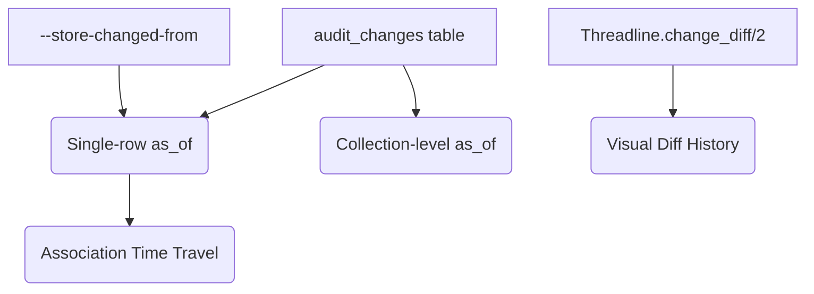

# Feature Landscape: As-of / History (Time Travel)

**Domain:** Audit Reconstruction & Temporal Queries
**Researched:** 2024-10-24
**Confidence:** HIGH

## Overview

"As-of" features allow developers to treat the audit log not just as a stream of events, but as a versioned data store. Top-tier libraries (Logidze, Carbonite, Envers) move beyond "what happened" to "what was the state of the world at X."

Because Threadline uses trigger-backed capture (Path B) which stores the full `NEW` row in `audit_changes.data` on every `INSERT` and `UPDATE`, reconstruction is significantly simpler than libraries that store only diffs.

---

## Table Stakes

Features users expect in any "History" implementation. Missing these makes the feature feel like a "toy."

| Feature | Why Expected | Complexity | Implementation Note |
|---------|--------------|------------|---------------------|
| **Single Row `as_of`** | Basic "view historical version" requirement for support/ops. | Low | `SELECT data FROM audit_changes WHERE ... AND inserted_at <= T ORDER BY id DESC LIMIT 1`. |
| **Deleted State Handling** | If the latest change before T is a `DELETE`, the record shouldn't exist. | Low | Must check `op` of the found audit record. |
| **Non-existence Check** | If the earliest change (INSERT) is after T, the record shouldn't exist. | Med | Requires querying for the absolute first change if no changes exist before T. |
| **Read-only Structs** | Developers want to use historical data in existing UI components (which expect Structs). | Med | Must cast JSONB to Struct and strip/freeze Ecto metadata to prevent accidental `Repo.update`. |
| **Map Fallback** | For schemas that have changed significantly (columns dropped). | Low | Provide a way to get raw data when Struct casting would fail. |

---

## Differentiators

Features that set Threadline apart and provide "Operator-Grade" power.

| Feature | Value Proposition | Complexity | Notes |
|---------|-------------------|------------|-------|
| **Collection `as_of`** | "List all active subscriptions as of last Monday." Vital for billing/compliance. | High | Requires `DISTINCT ON (record_id)` or `LATERAL JOIN` in SQL. |
| **Association Travel** | "Show this Post as-of T, with its Author as-of T." | Very High | Requires recursive reconstruction or "Global History T" context. |
| **Validity Range Indexing** | Optimization: Adding `valid_to` to audit rows to make range queries O(1). | High | Common in `Envers`. Requires updating "old" audit row on every new write. |
| **Visual Time-Slider** | UX: Scrolling through versions with field-level highlights. | Med | Combines `as_of` with existing `change_diff/2`. |
| **Audit Views** | Generating a Postgres View `posts_as_of_v` for external BI tools. | Med | Leverages SQL-native nature of Threadline. |

---

## Anti-Features

Features to explicitly NOT build (or defer).

| Anti-Feature | Why Avoid | What to Do Instead |
|--------------|-----------|-------------------|
| **Global `as_of` Context** | Using `Process.put` to set a global time T is dangerous in Elixir (async/Oban). | Require explicit T in all query/reconstruction functions. |
| **Automatic Reversion** | `as_of` should be a "Read" feature. Writing back to the DB is high-risk. | Provide an explicit `Threadline.revert_to(struct, T)` if needed later. |
| **Schema Evolution Tooling** | Trying to "migrate" historical JSON to new schemas is a rabbit hole. | Return a Map if the current Struct is incompatible. |

---

## Implementation Rationale: Map vs Struct

### Recommendation: **Struct with "Ghost" Metadata**

In the Elixir/Phoenix ecosystem, **Structs are the primary currency**. Returning a Map forces the developer to manually cast or rewrite their view templates.

**The DX Contract:**
1. **Default to Struct**: Use `Ecto.Schema.cast` or `struct/2` to load the `data` into the schema.
2. **Prevent Accidental Saves**: Set `__meta__.state` to `:built` (not `:loaded`) or add a virtual field `__threadline_historical__: true`.
3. **Handle Missing Fields**: If the JSON contains fields no longer in the Struct, they are ignored. If the Struct has new required fields not in the JSON, they remain `nil`.

---

## Feature Dependencies

*   **`--store-changed-from`**: While `as_of` primarily uses the `data` column, `changed_from` is essential for verifying the "Backward" reconstruction path or handling "Brownfield" records where the `INSERT` event is missing but we know the record changed later.

---

## MVP Recommendation

Prioritize **Single-Row Reconstruction** first. It solves 80% of support use cases (e.g., "What did this user's profile look like when they reported the bug?").

1.  **`Threadline.as_of(schema_or_struct, id, timestamp)`**: Core reconstruction logic.
2.  **`Threadline.as_of!(...)`**: Raises if deleted/non-existent.
3.  **Read-only Struct projection**: Cast JSONB to the provided Schema.

**Defer**: Collection-level queries and Association Travel. These are high-complexity and usually require project-specific SQL optimizations.

---

## Sources

- **Logidze (Ruby/Postgres)**: Pattern of replaying JSONB diffs.
- **Carbonite (Elixir)**: Transaction-as-unit and `as_of` query patterns.
- **Hibernate Envers (Java)**: The "Validity Strategy" (`rev` + `revend`) for O(1) time-travel queries.
- **PaperTrail (Elixir)**: `get_current_model` (reify) patterns.
