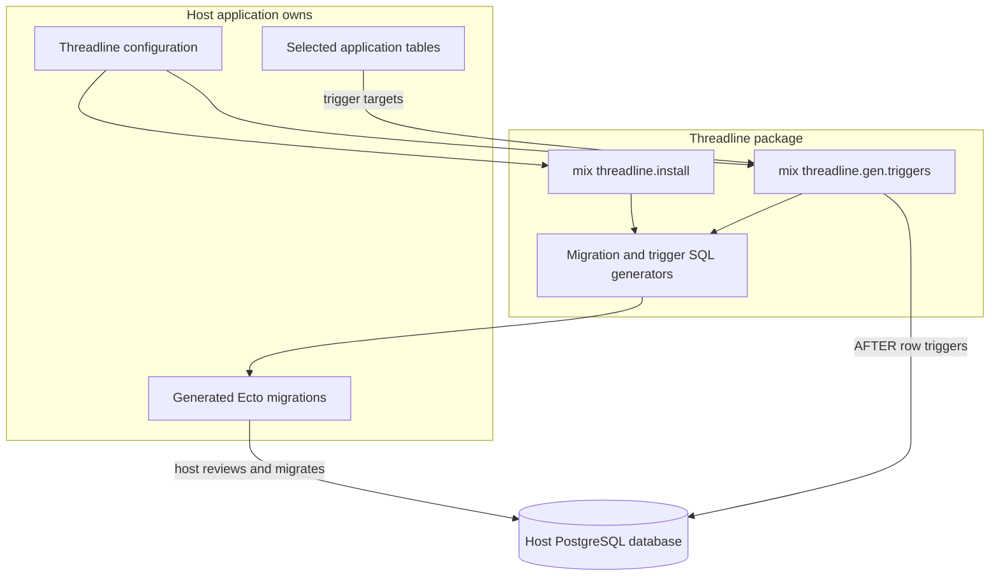
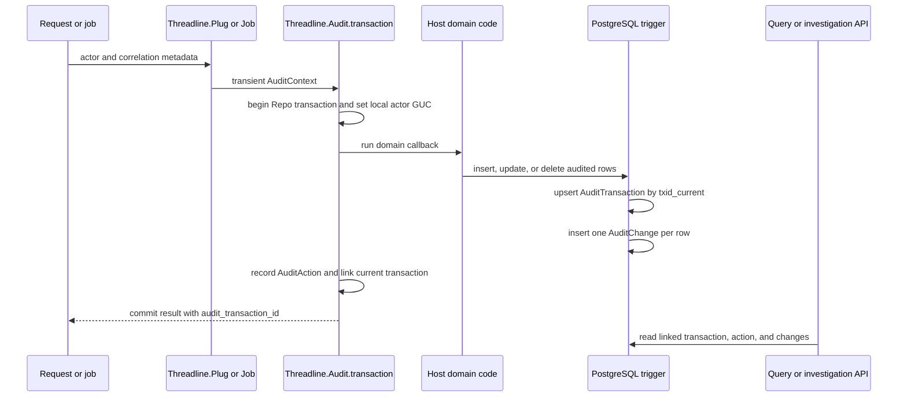
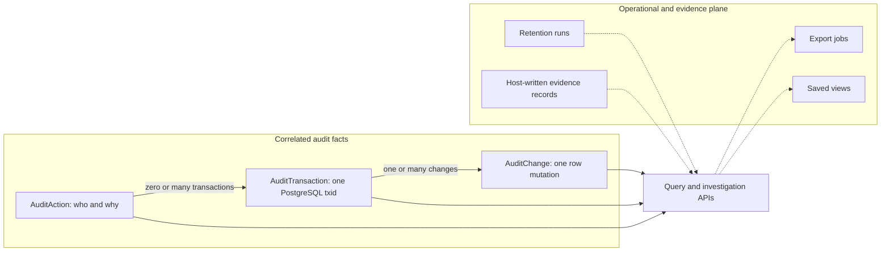

# How Threadline works

Threadline is embedded audit infrastructure for Phoenix, Ecto, and PostgreSQL applications. Read this guide when you need to trace one audited write end to end, decide which guarantees Threadline provides, and identify which decisions remain with the host application.

The architectural promise is simple:

> PostgreSQL records what changed. The host supplies who and why. Threadline keeps those facts linked and investigable.

That becomes a useful shorthand:

`database truth` + `application intent` + `host-owned policy`

Threadline is not event sourcing, a remote audit SaaS, an authentication framework, or a write-capable admin backend. It records and presents evidence about ordinary database writes without taking ownership of the application's domain model or security boundary.

## Threadline in one picture

```mermaid
flowchart LR
    accTitle: Threadline end-to-end audit flow
    accDescr: A host Phoenix and Ecto application supplies identity and intent, PostgreSQL triggers capture row changes, and Threadline query surfaces make the linked facts investigable under host authorization and scope.

    H["Host Phoenix and Ecto application"]
    A["Threadline.Audit.transaction"]
    P[("PostgreSQL transaction")]
    C["Trigger-captured audit facts"]
    Q["Threadline query and investigation APIs"]
    O["Host-authorized operator, export, or evidence surface"]

    H -->|"actor, intent, domain writes"| A
    A -->|"one database transaction"| P
    P -->|"row triggers"| C
    C -->|"linked facts"| Q
    Q -->|"scoped reads"| O
    H -.->|"auth, tenancy, retention policy"| O
```



There are two planes in this picture:

- The **capture plane** is PostgreSQL-first. Triggers create `Threadline.Capture.AuditTransaction` and `Threadline.Capture.AuditChange` rows from writes that actually reached audited tables.
- The **meaning and operations plane** is application-aware. `Threadline.Semantics.AuditAction`, investigations, exports, retention runs, saved views, and evidence records make captured facts useful without replacing host policy.

The optional operator surface reads through the same public query and investigation layers. It is not a second source of truth.

## Vocabulary for the trip

| Term | Meaning |
|---|---|
| `ActorRef` | A validated typed identity such as a user, administrator, job, service account, system process, or anonymous actor. |
| `AuditContext` | Transient request or job context containing the actor and correlation metadata. It is not itself a database record. |
| `AuditAction` | Application intent: what the host says the operation meant, plus correlation and request identifiers. |
| `AuditTransaction` | One PostgreSQL transaction that touched at least one audited table. The trigger groups its changes by `txid_current()`. |
| `AuditChange` | One inserted, updated, or deleted row captured by a trigger. |
| Capture-only | Physical changes exist, but no semantic action is linked. Strict correlation filters intentionally exclude them. |
| Correlation-ready | An action was created and linked to the capture transaction in the same audited-write helper call. |
| Evidence record | A host-written, append-only attestation about a closed governance subject such as trigger coverage or export delivery. |

The distinction between transient context and durable facts matters. `Threadline.Plug` can extract a correlation ID, but that ID becomes queryable through strict correlation only when `Threadline.Audit.transaction/3` records and links an action.

## Journey 1: installation creates host-owned database machinery

Threadline ships generators, not a remotely managed schema. Configuration is read when the generators run, and the resulting migration files belong to the host repository.



### Configure before generating

The storage schema defaults to `threadline`. A host can choose another valid PostgreSQL identifier, but it must do so before generation because the generated SQL carries that schema name.

```elixir
config :threadline,
  ecto_repos: [MyApp.Repo],
  storage_schema: "audit"
```

The Threadline storage schema and audited host-table schemas are separate ideas. Threadline tables may live in `audit` while an audited table lives in `public`, `support`, or another host schema. Changing the setting later does not rewrite migrations already generated or applied; moving the storage schema is a deliberate host migration.

### Generate three storage families, then table triggers

```bash
mix threadline.install
mix ecto.migrate
mix threadline.gen.triggers --tables public.posts,support.tickets
mix ecto.migrate
```

`mix threadline.install` creates missing migration families without overwriting a family already present:

- **Capture:** `audit_transactions`, `audit_changes`, and the global trigger function.
- **Semantics:** `audit_actions` and the action/actor linkage fields.
- **Governance:** export jobs, retention runs, saved views, and evidence records.

`mix threadline.gen.triggers` then creates an `AFTER INSERT OR UPDATE OR DELETE` trigger for each selected host table. It rejects every Threadline-owned table, even under a custom schema, because auditing the audit tables would recurse.

### Capture policy becomes database code

Most tables use the shared trigger function. A table receives its own function when it opts into sparse prior values or capture-time redaction.

```elixir
config :threadline, :trigger_capture,
  tables: %{
    "public.users" => [
      exclude: ["password_hash"],
      mask: ["email"],
      store_changed_from: true,
      except_columns: ["updated_at"]
    ]
  }
```

These controls have intentionally different meanings:

- `exclude` removes keys from stored row JSON and change detection.
- `mask` stores a stable placeholder instead of the value, including in prior values when enabled.
- `store_changed_from` stores sparse prior values for changed fields on updates.
- `except_columns` removes fields from `changed_fields` and `changed_from`; it does **not** remove them from `data_after` and is not a secrecy control.

Because redaction happens inside the trigger before the audit insert, excluded secrets never enter Threadline's row snapshot. The generated migration is the durable record of the policy that PostgreSQL actually runs; changing application configuration alone does not change an already deployed trigger function.

## Journey 2: an audited request becomes an investigation trail

The recommended audited write path is `Threadline.Audit.transaction/3`. It puts actor publication, domain writes, optional action creation, and linkage inside one `Repo.transaction/1`.



### 1. The edge builds transient context

`Threadline.Plug` resolves the actor through a host callback, reads request and correlation identifiers, formats the remote IP, and assigns an `AuditContext` to the connection. It performs no database call and never sets session state, so merely passing through the Plug cannot leak identity between pooled connections.

Background jobs use `Threadline.Job` to serialize and restore the same kind of context at a different edge.

### 2. The helper creates the atomic boundary

```elixir
{:ok, result} =
  Threadline.Audit.transaction(
    MyApp.Repo,
    [
      audit_context: audit_context,
      action: :ticket_replied_and_closed,
      transaction_meta: %{"organization_id" => organization_id}
    ],
    fn ->
      ticket = MyApp.Support.reply_to_ticket!(ticket, reply_attrs)
      ticket = MyApp.Support.close_ticket!(ticket)
      %{ticket: ticket}
    end
  )

result.audit_transaction_id
```

Before the callback writes, the helper serializes the validated `ActorRef` and calls PostgreSQL `set_config` with the transaction-local flag. The trigger reads that value with `current_setting`. This is safe under PgBouncer transaction pooling because neither side relies on session-local state.

The callback may perform ordinary domain inserts, updates, and deletes, and may call `Repo.rollback/1`. It must not open a nested transaction, set the Threadline GUC itself, or call `Threadline.record_action/2`; those operations would split responsibility for the atomic linkage.

### 3. PostgreSQL records what reached the tables

The first audited row mutation in a transaction upserts one `AuditTransaction` keyed by `txid_current()`. Every audited row mutation then inserts an `AuditChange` pointing to that transaction. Multiple domain writes in the callback therefore share one capture transaction without depending on call order in Elixir.

The trigger records the actual table schema, table name, primary-key map, operation, post-change snapshot, changed field names, optional prior values, and capture timestamp. Deletes have no post-change snapshot.

### 4. The helper links application meaning

After the callback succeeds, an `:action` option causes the helper to create `AuditAction`, update the current `AuditTransaction.action_id`, apply transaction metadata, and fetch the audit transaction ID. If the expected capture transaction cannot be linked, the helper rolls the entire database transaction back.

Omitting `:action`, or setting `capture_only: true`, keeps physical capture but creates no semantic row. Missing actors fail by default; an explicitly allowed missing actor is available only for capture-only paths.

### 5. Reads reconstruct the trail

Public query helpers return captured Ecto structs or higher-level investigation structures:

- `Threadline.history/3` and `Threadline.Investigation.row_history/4` follow one application row.
- `Threadline.timeline/2` reads a bounded eager slice; `Threadline.timeline_page/2` uses keyset pages ordered by `(captured_at, id)`.
- `Threadline.Investigation.actor_window/3` and `correlation_bundle/3` add linked context.
- `Threadline.incident_bundle/2` packages one transaction, its optional action, all changes, and deterministic diffs.
- `Threadline.as_of/4` returns the latest stored snapshot, `:deleted_record`, or `:before_audit_horizon`; it does not invent history before capture began.
- `Threadline.export_csv/2` and `Threadline.export_json/2` reuse the timeline filter vocabulary.

A correlation filter is deliberately strict: it inner-joins through the linked action. Request headers alone and capture-only writes do not match it.

## The data model is the architecture



An action is not a row change, and a request is not necessarily a database transaction. Keeping those concepts separate preserves useful truth:

- A single semantic action may describe multiple capture transactions when a host deliberately links them.
- One capture transaction may contain many row changes across many audited tables.
- A capture-only transaction remains valid physical evidence even when application intent is unavailable.
- Governance records describe operation of the audit system; they do not replace the captured facts.

## Safety properties

The design concentrates important guarantees at boundaries that can enforce them:

- **Atomic linkage:** domain writes, actor publication, optional action creation, metadata, and action linkage share one database transaction. Linkage failure rolls back the domain writes.
- **Database-level observation:** triggers see writes made through ordinary Ecto calls, scripts, or direct SQL as long as they reach an audited table with triggers installed.
- **Transaction-local identity:** the actor GUC is local to the transaction, and transaction grouping uses `txid_current()`, preserving PgBouncer transaction-pooling safety.
- **Actor posture:** correlation-ready writes require a validated actor. Anonymous is an explicit actor type; absent is a separate, narrowly opt-in capture-only state.
- **Capture-time secrecy:** `exclude` and `mask` transform values before the audit insert. `except_columns` only reduces change-detail noise.
- **Recursion prevention:** trigger generation rejects Threadline's own storage tables.
- **Strict correlation:** correlation filters return only changes connected through `AuditTransaction.action_id` to a matching action.
- **Truthful reconstruction:** `as_of/4` distinguishes deleted records and the pre-audit horizon instead of guessing.
- **Host security ownership:** operator authorization, capability gates, tenant scope, actor extraction, and exposed routes remain host decisions. Threadline passes opaque scope through the configured query callback.
- **Conservative lifecycle:** retention is disabled by default, purges in batches, records runs, and uses a PostgreSQL advisory lock to avoid concurrent pruners.

No audit library can protect a value that was captured before its redaction policy was deployed, prove trigger coverage without checking the live database, or turn an unauthenticated mount into a secure one. Those are deployment facts the host must verify.

## Cross-cutting operations

### Query, investigation, and optional UI

`Threadline.Query` owns filter validation, joins, total ordering, cursors, and host scope application. `Threadline.Investigation` composes those primitives into operator questions and linked diffs. The optional `threadline_operator_surface/2` macro mounts LiveViews and export routes inside the host router, where the host supplies pipelines and authorization callbacks.

Coverage, policy, and evidence capabilities have separate fail-closed gates. A host scope is opaque to Threadline: the configured three-argument callback receives the Ecto query, scope value, and a surface/params context, then returns the narrowed query.

### Exports

Small synchronous exports share the timeline query. Asynchronous exports persist a job, stream keyset-ordered rows to a temporary CSV, hand the file to a `Threadline.Storage` adapter, and finish in a completed or failed terminal state. The default queue uses an OTP task supervisor; hosts can provide durable queue and multi-node storage adapters through the published behaviours.

### Retention

Retention is an explicit operational policy, not an invisible cleanup. When enabled, the supervised pruner acquires a database advisory lock, deletes eligible changes in bounded batches, yields between batches, and records the run. Capture and retention answer different questions: capture records what happened; retention decides how long those facts remain available.

### Evidence

`Threadline.Evidence` exposes six subject-specific write entrypoints for redaction policy, trigger coverage, retention runs, retention policy, export delivery, and support-scope posture. Host code calls those entrypoints deliberately. Threadline does not auto-populate compliance claims, provide legal holds, promise immutable storage beyond the configured backend, or own an RBAC or tenancy model.

### Runtime ownership

Ecto, Postgrex, Jason, NimbleCSV, Plug, and telemetry support the core. Phoenix, LiveView, Phoenix HTML/PubSub, Oban, and S3-related libraries are optional. At application start, Threadline validates configured adapters and only supervises export and retention processes when the required host repository and settings are present.

## Module atlas

| Question | Start with |
|---|---|
| How is storage named and generated? | `Threadline.StorageSchema`, `Mix.Tasks.Threadline.Install`, `Mix.Tasks.Threadline.Gen.Triggers` |
| What exactly does the trigger write? | `Threadline.Capture.TriggerSQL`, `Threadline.Capture.AuditTransaction`, `Threadline.Capture.AuditChange` |
| How does identity enter the write? | `Threadline.Semantics.ActorRef`, `Threadline.Semantics.AuditContext`, `Threadline.Plug`, `Threadline.Job` |
| What is the supported audited-write boundary? | `Threadline.Audit` |
| How are physical and semantic facts linked? | `Threadline.Semantics.AuditAction`, `Threadline.Capture.AuditTransaction` |
| How do filters, pages, and scopes work? | `Threadline.Query`, `Threadline.OperatorSurface.Scope` |
| How is an incident assembled? | `Threadline.Investigation`, `Threadline.ChangeDiff` |
| How is the UI mounted securely? | `Threadline.OperatorSurface.Router`, `Threadline.OperatorSurface.Auth` |
| How do large exports leave the process? | `Threadline.Export`, `Threadline.ExportQueue`, `Threadline.Storage`, `Threadline.Export.Orchestrator` |
| How are lifecycle and attestations represented? | `Threadline.Retention`, `Threadline.Retention.Pruner`, `Threadline.Evidence` |

## Code-reading routes

Choose a route based on the question you are answering:

1. **Audited write:** `Threadline.Plug` → `Threadline.Audit` → `Threadline.Capture.TriggerSQL` → the three core schemas → `Threadline.Investigation`.
2. **Capture policy:** `Threadline.StorageSchema` → the two Mix generators → `Threadline.Capture.RedactionPolicy` → `Threadline.Capture.TriggerSQL` → trigger and redaction tests.
3. **Operator security:** `Threadline.OperatorSurface.Router` → `Threadline.OperatorSurface.Auth` → `Threadline.OperatorSurface.Scope` → query scope tests.
4. **Operational lifecycle:** `Threadline.Export` and its queue/storage behaviours → `Threadline.Export.Orchestrator`; then `Threadline.Retention.Pruner` and `Threadline.Evidence`.

The [Code walkthrough](code-walkthrough.md) follows these routes with short excerpts from the implementation and names the tests that prove each seam.

## Changing Threadline safely

When changing the system, preserve the ownership boundary before optimizing a local function:

1. State whether the change affects capture, semantic linkage, reads, or governance.
2. Keep generated SQL and migrations deterministic; a host must be able to review what will run.
3. Treat capture redaction and recursion guards as secrecy and availability controls, not presentation details.
4. Preserve the single-transaction audited-write invariant and strict correlation semantics.
5. Keep query order total and cursor-compatible whenever pagination changes.
6. Pass authorization and tenant scope back to the host instead of inventing Threadline-owned policy.
7. Prove the change at the lowest useful layer, then add an end-to-end test for the boundary it crosses.

For release work, verify source contracts, generated docs, the Hex package, and any PostgreSQL-backed capture behavior. Do not update documentation to describe a more convenient architecture than the code actually ships.

## Where to go next

- [Code walkthrough](code-walkthrough.md) — read the implementation in the same order as this guide.
- [Getting started with Phoenix SaaS](getting-started-saas.md) — install and exercise the supported write path.
- [Domain reference](domain-reference.md) — exact vocabulary and public API routing.
- [Integration contracts](integration-contracts.md) — host-owned identity, jobs, scope, and adapters.
- [Operator surface](operator-surface.md) — secure mounting and operator capabilities.
- [Production checklist](production-checklist.md) — deployment and live-database verification.
- [Incident playbook](incident-playbook.md) — use the captured trail during an investigation.
